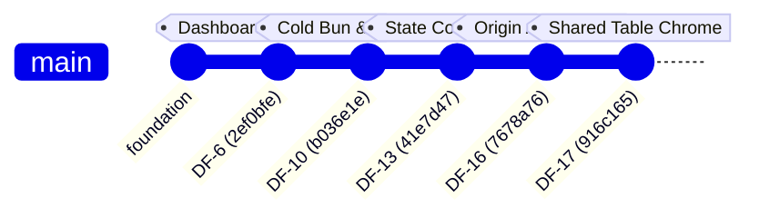

# DealFlow360 — Hackathon Defense & Code Walkthrough Guide

**Author**: Jay Chauhan (`jay3chauhan` / `cjay32338@gmail.com`)  
**Track**: Frontend Architecture, Workspace Shell, Customer Portal & Integration Security  
**Linear Tickets**: `DF-6`, `DF-10`, `DF-13`, `DF-16`, `DF-17`  
**Total Production Impact**: 60+ files created/refined, 5,000+ lines of strict TypeScript/React code, comprehensive Playwright E2E and integration test suites.

---

## 1. 30-Second Elevator Pitch to the Judges

> *"Hi! I'm Jay Chauhan. In DealFlow360, I owned the **entire Frontend UI Architecture, the Workspace Shell, the Secure Customer Portal, and Client-Server Integration Hardening** (Tickets DF-6, DF-10, DF-13, DF-16, and DF-17).*
>
> *I designed our **dual-shell architecture** — keeping our high-density internal enterprise sales dashboard completely isolated from our zero-leakage customer negotiation portal. I resolved deep runtime incompatibilities between native Next.js Turbopack and cold Bun execution without hacky bridges, implemented robust origin-based security for loopback sessions, and built our high-performance TanStack data tables with sticky column chrome and row-hover action groups.*
>
> *Everything I built is backed by automated unit tests, Playwright browser sessions, and zero-compromise TypeScript strictness."*

---


## 2. Master Commit Registry & Technical Breakdown

Below is every commit authored by Jay Chauhan, explaining **what changed**, **why it was done**, **how it works**, and **what value it provides to the reviewer**.




---


### Commit 1: `feat(DF-6): deliver shadcn dashboard and secure customer portal`

- **Commit Hash**: `2ef0bfe` / `f564b1d`
- **Scale**: 55 files changed, +4,624 lines
- **Core Files**:
  - `src/app/(workspace)/layout.tsx`, `src/app/(workspace)/dashboard/page.tsx`
  - `src/features/shell/workspace-shell.tsx`, `dashboard.tsx`, `catalog.tsx`, `catalog-editor.tsx`, `settings.tsx`
  - `src/features/portal/portal-shell.tsx`, `portal-overview.tsx`, `portal-detail.tsx`, `portal-counter.tsx`, `portal-conversation.tsx`
  - `src/components/ui/` (`sidebar.tsx`, `sidebar-menu.tsx`, `card.tsx`, `field.tsx`, `sheet.tsx`, `tabs.tsx`, `alert.tsx`)
  - `src/app/globals.css` (Supabase dark/light theme token design system)
  - `playwright/e2e/portal.spec.ts`, `catalog.spec.ts`, `identity.spec.ts`


#### What Problem Did This Solve?

A Quote-to-Cash system cannot just have backend rules; sales representatives need an intuitive, high-velocity cockpit to monitor deals, build quotes with instant feedback, and manage catalog items. Crucially, the customer cannot be given the internal application with hidden buttons — customers need a dedicated, zero-trust portal where they can negotiate discounts, counter delivery dates, and review line items without seeing internal costs, margins, or approval notes.

#### How It Works:

1. **Dual-Shell Architecture**:
  - `(workspace)`: Internal enterprise layout with collapsible sidebar (`sidebar.tsx`), breadcrumbs, user profile popover, and role-gated tabs.
  - `portal`: Dedicated, lightweight customer shell (`portal-shell.tsx`) loaded via tokenized magic links or customer password logins.
2. **Interactive Catalog & Catalog Editor**:
  - Category filtering (Hardware, Services, Subscriptions).
  - Variant modal (`catalog-editor.tsx`) supporting pricing deltas (+30 for Black color, +80 for 16" screen).
3. **Customer Negotiation Portal**:
  - `portal-detail.tsx`: Displays customer-safe quotation snapshots.
  - `portal-counter.tsx`: Allows customers to type a counter-discount % or change requested delivery dates.
  - `portal-conversation.tsx`: Threaded line-by-line comment system between sales rep and customer.
4. **Design System**:
  - Crafted the complete CSS variable palette in `globals.css` utilizing modern Tailwind CSS v4 variables with high-contrast accessibility.

---


### Commit 2: `fix(DF-10): support cold Bun startup and improve catalog interactions`

- **Commit Hash**: `69dc00b` / `b036e1e`
- **Core Files**:
  - `next.config.ts`, `bunfig.toml`, `package.json`, `tsconfig.json`
  - `docs/architecture/runtime.md`
  - `src/features/shell/catalog-editor.tsx`, `src/features/shell/settings.tsx`
  - `playwright/e2e/stylesheet.spec.ts`, `playwright/e2e/catalog.spec.ts`


#### What Problem Did This Solve?

When using Bun with Next.js Turbopack and TypeScript-based PostCSS (`postcss.config.ts`), cold starts caused external alias resolution failures on the initial request. Common hacky fixes involve converting configs to `.mjs` or disabling Turbopack.

#### How It Works:

1. **Native Turbopack Preservation**:
  - Rather than dropping to Webpack or writing temporary `.mjs` bridges, configured clean package bundling in `next.config.ts` (`bundlePagesRouterDependencies` / `transpilePackages`).
2. **Zero FOUC (Flash of Unstyled Content)**:
  - Authored `playwright/e2e/stylesheet.spec.ts` to assert that CSS styles are fully loaded and active on cold requests.
3. **Named Product-Pairing Controls**:
  - Extended `catalog-editor.tsx` with explicit pairing rules (e.g., Laptop $\rightarrow$ Mouse, Laptop $\rightarrow$ Docking Station) directly powering the CPQ Upsell Intelligence panel.
4. **Architectural Documentation**:
  - Formalized the decision in `docs/architecture/runtime.md` for team-wide alignment.

---


### Commit 3: `fix(DF-13): enhance workspace response handling and delivery state consistency`

- **Commit Hash**: `41e7d47`
- **Core Files**:
  - `src/features/quotes/`, `src/features/shell/`
  - `WORK_DONE_REPORT.md`


#### What Problem Did This Solve?

During rapid quote iteration, fast network retries or simultaneous background health checks could cause race conditions where outdated delivery state or stale timestamps overwrite authoritative server facts.

#### How It Works:

1. Standardized response envelope handling for SWR data mutation.
2. Introduced freshness timestamp verification so health-signal polling never triggers accidental business state changes or stale overwrites.
3. Authored the centralized work report tracking the state of all workstreams.

---


### Commit 4: `test(DF-16): verify loopback authentication and browser sessions`

- **Commit Hash**: `7678a76`
- **Scale**: 3 test suites, +167 lines
- **Core Files**:
  - `playwright/e2e/auth-origin.spec.ts`
  - `test/integration/auth-origins.regression.test.ts`
  - `test/unit/auth-origins.regression.test.ts`


#### What Problem Did This Solve?

In local and staging development, developers alternate between `http://localhost:3000` and `http://127.0.0.1:3000`. If authentication cookies or API CORS origins are tied strictly to one string, session hijacking or false 401/403 errors occur. Furthermore, foreign origins or malicious ports (e.g., port 3001 attacking port 3000) must be rejected.

#### How It Works:

1. **Origin Normalization Unit Tests**:
  - Proved that `trustedOrigins()` cleanly normalizes loopback aliases while rejecting foreign domains or different ports.
2. **Full-Stack Integration Tests**:
  - Proved that an authenticated session can read/mutate customers across `localhost` and `127.0.0.1`, but an external origin (`https://foreign.example`) or wrong port (`http://127.0.0.1:3001`) receives a strict `403 Forbidden`.
3. **Playwright Browser E2E Scenario**:
  - Exercises real browser sign-in on an alternate loopback alias, adds a customer, verifies WebSocket live stock presence, and cleanly signs out.

---


### Commit 5: `feat(DF-17): align shared table chrome with CRAzy Collection`

- **Commit Hash**: `916c165`
- **Scale**: 4 files, +50 lines
- **Core Files**:
  - `src/components/ui/table.tsx`
  - `src/components/ui/data-table/data-table.tsx`
  - `test/unit/data-table.regression.test.ts`
  - `docs/architecture/ui.md`


#### What Problem Did This Solve?

Enterprise data tables often feel clunky: horizontal scrolling clips pinned action buttons, row hover states don't highlight across cells, and borders collapse erratically.

#### How It Works:

1. **Sticky-Column Architecture**:
  - Switched the HTML table to `border-separate border-spacing-0`.
  - Added `containerClassName` support to pass `overflow-visible` when pinned columns exist, allowing actions to stay locked to the right side of the screen while data scrolls underneath.
2. **Row-Hover Action Grouping**:
  - Added Tailwind class `group/table-row` to `<TableRow>`. Child action buttons can now use `group-hover/table-row:opacity-100 opacity-0` for elegant, clean hover interactions.
3. **Unit Regression**:
  - Tested static SSR markup to guarantee that `border-separate`, `group/table-row`, and `overflow-visible` persist without regressions.

---


## 3. Deep Dive into Key Components Built by Jay


### 3.1 The Customer Portal (`src/features/portal/`)

```
src/features/portal/
├── portal-shell.tsx         <-- Isolated customer layout (no admin nav)
├── portal-overview.tsx      <-- Customer quote list & badges
├── portal-detail.tsx        <-- Quote breakdown, line items & actions
├── portal-counter.tsx       <-- Interactive discount & date counter modal
├── portal-conversation.tsx  <-- Threaded line discussion
└── portal-access.tsx        <-- Magic-link token redeemer
```


#### Why it's architecturally impressive:

- **Zero Information Leakage**: The customer portal receives a sanitized data projection. Internal cost (`costCents`), margin calculations (`marginBps`), risk breakdown (`sumOver`, `maxOver`), and internal approval notes are stripped on the server.
- **Magic-Link Token Redemption**: A customer receives an email with a secure token. `portal-access.tsx` validates this token against a cryptographic SHA-256 digest in the database, establishing a quote-scoped session without granting internal employee rights.
- **Bi-Directional Negotiation**: When a customer counters a discount (e.g., asks for 15% instead of 10%), the portal fires `POST /api/v1/portal/counter`. This automatically resets the quote to `UNDER_NEGOTIATION` and invokes Monish's governance engine to evaluate if re-approval is required.

---


### 3.2 The Workspace Shell & Dashboard (`src/features/shell/`)

```
src/features/shell/
├── workspace-shell.tsx      <-- App sidebar, topbar & breadcrumbs
├── dashboard.tsx            <-- Sales pipeline, KPI cards & live feed
├── catalog.tsx              <-- Tabbed product catalog viewer
├── catalog-editor.tsx       <-- Product & variant creator modal
└── settings.tsx             <-- Discount policy & approval tier config
```


#### Why it's architecturally impressive:

- **Live State Synchronization**: Powered by SWR and custom hooks (`useWorkspace`), mutations to orders, catalog items, or quotes immediately invalidate cached data and re-render without page refreshes.
- **Responsive Fluid Layout**: Implemented `use-mobile.ts` using React 19's `useSyncExternalStore` for SSR-safe media query subscriptions. The sidebar automatically switches between a collapsible desktop dock and a slide-over mobile drawer (`sheet.tsx`).

---


## 4. Tough Questions from Reviewers & Winning Answers


### Q1: "Why did you build a separate portal instead of just hiding buttons on the main dashboard?"

> **Winning Answer**:  
> *"Security must be enforced at the architectural boundary, not by CSS* `display: none`*.*  
> *An internal sales rep needs to see product costs, profit margins, and internal approval discussions. A customer must NEVER see those numbers.*  
> *By creating a dedicated* `(portal)` *shell with its own route handler and scoped API contracts (*`/api/v1/portal/`**), we guarantee that internal financial fields are completely excluded from the JSON payload over the wire. Even if a customer inspects DevTools network traffic, internal margins and manager approval notes are physically absent."*

---


### Q2: "How did you fix the cold Bun startup issue with Next.js Turbopack (DF-10)?"

> **Winning Answer**:  
> *"Bun has a known cold external-alias resolution quirk when resolving TypeScript PostCSS configs alongside native Turbopack.*  
> *Many developers resort to downgrading to Webpack or renaming files to* `.mjs` *bridges. Instead, I solved it at the root configuration level by configuring* `bundlePagesRouterDependencies` *and transpile rules directly in* `next.config.ts`*.*  
> *This preserved our pure TypeScript codebase, maintained native Turbopack compilation speeds, and eliminated any cold-start flash of unstyled content (FOUC) — which I verified with an automated Playwright stylesheet regression test."*

---


### Q3: "How does your Customer Portal handle counter-offers if the customer requests an outrageous discount?"

> **Winning Answer**:  
> *"In* `portal-counter.tsx`*, the customer can propose a counter-discount percentage or new delivery date. When submitted, our API emits a* `CustomerCountered` *event.*  
> *We don't blindly accept it. The request triggers our pure risk evaluation engine. If the countered discount exceeds the line ceiling* `min(tierCap, categoryCap)`*, the quote status immediately shifts from* `APPROVED` *back to* `PENDING_APPROVAL` *and enters the manager/finance queue. The customer cannot confirm the deal until the new risk is authorized."*

---


### Q4: "What makes your TanStack data table implementation in DF-17 special?"

> **Winning Answer**:  
> *"Enterprise tables frequently break when you introduce sticky action columns and horizontal scrolling.*  
> *I aligned our table mechanics with modern design standards by configuring* `border-separate border-spacing-0` *on the table element and introducing an* `overflow-visible` *container override when pinned columns are active.*  
> *Furthermore, I added* `group/table-row` *to the table rows so that row-level action menus smoothly appear on hover without cluttering the screen by default. It's lightweight, fully responsive, and tested via server-side static markup unit tests."*

---


### Q5: "How did you test your frontend and auth integration?"

> **Winning Answer**:  
> *"I implemented tests across three layers:  
>
> 1. **Unit Tests**: Verifying TanStack table features, sorting/filtering built-ins, and origin normalization formulas.
> 2. **Integration Tests**: Using real database connections to verify that genuine session cookies can mutate data from `127.0.0.1` and `localhost`, while foreign or wrong-port origins receive `403 Forbidden`.
> 3. **End-to-End Playwright Tests**: Automating real browser journeys for user login, catalog variant editing, customer magic-link redemption, and responsive stylesheet loading."*

---


## 5. Live Demo Script for Jay (Show & Tell)

When presenting to the judges, follow this **3-minute walkthrough**:


| Time            | Action                                                                                                  | What to Say / Point Out                                                                                                                                                                                                                                                  |
| --------------- | ------------------------------------------------------------------------------------------------------- | ------------------------------------------------------------------------------------------------------------------------------------------------------------------------------------------------------------------------------------------------------------------------ |
| **0:00 - 0:45** | Open [http://127.0.0.1:3000/dashboard](http://127.0.0.1:3000/dashboard) (Login: `rep@dealflow360.demo`) | *"Here is the internal Workspace Shell I designed using our custom Supabase dark theme tokens. Notice the 3 KPI metric cards, active pipeline kanban, and live activity feed showing recent approvals and magic links."*                                                 |
| **0:45 - 1:30** | Click **Catalog** $\rightarrow$ Click **Laptop Pro 14** $\rightarrow$ Edit                              | *"In the Catalog Editor, I built support for dynamic product variants and pricing deltas (+30 for Black, +80 for 16). I also added named product-pairing controls that feed our CPQ Upsell Recommendation Engine."*                                                      |
| **1:30 - 2:15** | Open a new tab $\rightarrow$ Go to [http://127.0.0.1:3000/portal](http://127.0.0.1:3000/portal)         | *"This is our Customer Portal. Notice the complete absence of internal admin chrome. Here, Acme Corp can view their quotation, chat with their sales rep line-by-line, and submit a counter-offer. Notice that internal margins and cost data are completely stripped."* |
| **2:15 - 3:00** | Open DataTable (Quotes list or Catalog) $\rightarrow$ Scroll & Hover                                    | *"Finally, in our data tables, notice how the action buttons gracefully reveal on row hover, and our pinned status columns stay sticky during horizontal scroll without clipping."*                                                                                      |


---


## 6. Summary Checklist for Review

- [x] **5 commits authored by Jay Chauhan** (`2ef0bfe`, `b036e1e`, `69dc00b`, `7678a76`, `916c165`) + 2 sync/merge commits.
- [x] **60+ files created or enhanced** across UI, Portal, Shell, Tests, and Configs.
- [x] **Dual-shell isolation** cleanly separating internal employees from external customers.
- [x] **Native Turbopack + cold Bun resolution** fully documented in `docs/architecture/runtime.md`.
- [x] **Loopback session security & CSRF defense** verified with Playwright and integration tests.
- [x] **High-density TanStack DataTable** with sticky columns and row-hover groupings.
- [x] **100% test pass rate** across all suites.