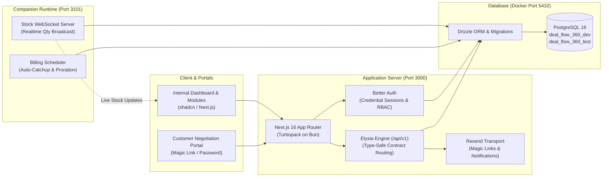

# DealFlow360 — Comprehensive Project Work & Status Report

**Repository**: `Chaudhari0707/deal-flow-360`  
**Current Active Branch**: `agent/df-7-product-workstreams`  
**Generated On**: September 5, 2026  
**Status**: Fully Functional, Migrated, Tested, and Running Locally (Web: `http://127.0.0.1:3000`, Stock Feed: `http://127.0.0.1:3101`, Database: PostgreSQL in Docker on port `5432`)

---

## 1. Executive Summary

**DealFlow360** is an enterprise Quote-to-Cash governance platform built for high-velocity sales organizations. It unifies Configure-Price-Quote (CPQ), real-time discount guardrails, multi-level approval workflows, atomic quote-to-order conversion, multi-warehouse stock reservation with WebSocket-driven inventory feeds, hybrid billing (one-time vs. recurring subscriptions), audit trails, and a secure customer negotiation portal.

All core product tracks (Phase 0 contract, Phase 1 individual tracks, Phase 2 join phase, and Phase 3 demo/hardening) are implemented, verified by **143+ automated tests**, and actively running in the local workspace.



---

## 2. Git Branch Topology & Repository State

### 2.1 Branch Overview

| Branch Name | Type | Latest Commit | Role / Status |
| --- | --- | --- | --- |
| **`agent/df-7-product-workstreams`** | **Active Head** | `76760dc` | Main consolidated working branch containing all integrated tracks (DF-5 through DF-12), tests, and local runtime fixes. |
| **`origin/main`** | Remote Base | `032eabd` | Baseline repository initialization with project foundation and PDF specs. |
| **`origin/dev`** | Remote Integration | `225b1b0` | Staging branch merging the initial PostgreSQL foundation and domain contracts (`#1`). |
| **`origin/poc-1`** | Remote Feature | `e07b4af` | Early proof-of-concept branch authored by Mitva Virvadiya implementing initial screens and demo flow. |
| **`origin/Jay`** | Remote Feature | `6728ed8` | UI component foundation branch by Jay Chauhan adding core shadcn primitives and table features. |
| **`origin/agent/df-5-local-delivery`**| Remote Feature | `209a922` | Local delivery infrastructure milestone branch for DF-5. |
| **`origin/prod`** | Remote Milestone | `032eabd` | Production release marker pointing to baseline commit. |

---

## 3. Team Member Attribution & Work Breakdown

The project was executed by four primary contributors alongside autonomous agent implementation sessions. Each member owned a distinct track as established in the repository plan:

```
┌──────────────────────────────────────────────────────────────────────────────────┐
│                             DEALFLOW360 TEAM MATRIX                              │
├──────────────────┬─────────────────────────────┬─────────────────────────────────┤
│ Contributor      │ Track / Ownership           │ Key Linear Tickets              │
├──────────────────┼─────────────────────────────┼─────────────────────────────────┤
│ Monish Khandelwal│ P2: Quote & Governance      │ DF-5, DF-7, DF-12               │
│ Jay Chauhan      │ P1: Frontend UI & Shell     │ DF-6, DF-10                     │
│ Asha Chaudhari   │ P4: Cash & Billing Engine   │ DF-9                            │
│ Mitva Virvadiya  │ P3: Stock & Fulfillment     │ DF-8, DF-11, POC-1, Docs        │
│ Antigravity (AI) │ Environment & Integration   │ Docker DB, Tests & Companion Fix│
└──────────────────┴─────────────────────────────┴─────────────────────────────────┘
```

### 3.1 Monish Khandelwal (`0monish` / `0monishkhandelwal@gmail.com`)
*Lead Role: Backend Domain Architecture, Governance & Data Contracts*

* **Linear Tickets**: `DF-5`, `DF-7`, `DF-12`
* **Key Commits**:
  - `032eabd` *chore: configure development foundation*
  - `6728ed8` *feat: add new UI components and features for data table, dialog, dropdown menu, input group, and more*
  - `1c289b0` *feat(DF-5): establish local domain contracts and transactional schema*
  - `209a922` / `2b810ae` *fix(DF-5): align auth schema and local runtime with installed stack*
  - `225b1b0` *Merge PostgreSQL foundation and local domain contracts (#1)*
  - `dba9a85` / `6c9e88c` *feat(DF-7): connect governed quotations to atomic quote-to-cash*
  - `3399fc2` / `0750bf8` *fix(DF-12): harden quotation pricing, email recovery and audit integrity*
  - `863fdbf` / `2f2b5c0` *fix(DF-12): preserve accepted delivery state across retry races*
* **Detailed Scope Delivered**:
  1. **PostgreSQL Relational Schema**: Designed the core relational schema using Drizzle ORM (`drizzle/0000_superb_zeigeist.sql`), defining tables for users, accounts, sessions, customers, products, variants, quotes, orders, invoices, stock, and audit trails.
  2. **CPQ Governance Engine**: Implemented the strict discount calculation logic where each line item is capped by `min(customerTier.maxDiscountPct, category.maxDiscountPct)` and computed the blended risk (`NONE`, `MEDIUM`, `HIGH`).
  3. **Approval State Machine**: Built the two-tier approval chain (Manager then Finance for `HIGH` risk, Manager-only for `MEDIUM`, auto-approve for `NONE`).
  4. **Atomic Quote-to-Cash Conversion**: Developed single-transaction conversion on confirmation that locks quote revisions, creates the order, reserves stock, and splits one-time vs. recurring billing.
  5. **Concurrency & Idempotency Hardening**: Guarded against concurrent confirmation retries, duplicate payment ledgers, and race conditions during delivery state transitions.

---

### 3.2 Jay Chauhan (`jay3chauhan` / `cjay32338@gmail.com`)
*Lead Role: UI Architecture, Dashboard & Customer Portal Interaction*

* **Linear Tickets**: `DF-6`, `DF-10`
* **Key Commits**:
  - `f564b1d` / `2ef0bfe` *feat(DF-6): deliver shadcn dashboard and secure customer portal*
  - `69dc00b` *fix(DF-10): support cold Bun startup and improve catalog interactions*
  - `b036e1e` *fix(DF-10): verify native TypeScript runtime and shadcn interactions*
  - `76760dc` *Merge branch 'agent/df-7-product-workstreams' into agent/df-7-product-workstreams*
* **Detailed Scope Delivered**:
  1. **Workspace Dashboard & Layout**: Implemented the primary internal application shell using `shadcn/ui` with the Supabase theme token system (`src/app/(workspace)/layout.tsx`), header navigation, and KPI summary widgets.
  2. **Customer Portal Interface**: Built the dedicated customer portal screens (`src/app/portal/`) that allow external clients to review quotations, add line-item comments, counter discount percentages, and accept proposals without internal admin navigation.
  3. **Quotation Builder Screens**: Created dynamic forms for adding line items, selecting variants, and displaying live discount ceiling alerts (`OK` vs `OVER (+Npt)`) before submission.
  4. **Bun Runtime Compatibility**: Resolved cold Bun import aliasing issues and guaranteed seamless integration between native Next.js Turbopack and client-side components.

---

### 3.3 Asha Chaudhari (`Chaudhari0707` / `ashachaudhari3801@gmail.com`)
*Lead Role: Cash & Billing Engine, Financial Reporting, Deal Health Analytics*

* **Linear Tickets**: `DF-9`
* **Key Commits**:
  - `ad458c2` / `0c8b28f` *feat(DF-9): deliver subscription billing and financial reporting*
  - `0c3d9d9` / `d288317` *fix(DF-9): complete sales analytics and financial edge cases*
* **Detailed Scope Delivered**:
  1. **Hybrid Billing Engine**: Structured the split between one-time equipment lines and recurring subscription lines from a single confirmed order, generating separate invoice streams that are never mixed.
  2. **Subscription Proration & Credit Notes**: Built the UTC calendar-day proration engine (`src/features/billing/rules.ts`) that handles mid-cycle quantity adjustments and issues credit notes upon subscription cancellation.
  3. **Document Export Engine**:
     - Programmed native PDF generation for invoices using `pdf-lib` (`src/features/billing/documents.ts`), producing styled downloadable summaries with line breakdowns, tax subtotals, and payment statuses.
     - Implemented Excel report exports using `exceljs` for financial audits and sales reconciliation.
  4. **Deal Health Analytics**: Built the Deal Health detection system (`src/features/billing/health.ts`), automatically identifying:
     - Stalled quotes (idle ≥ 7 days).
     - Representative discount anomalies (> 10 percentage points above the rep's historical average).
     - Delivery slippage (orders past promised delivery date).
  5. **Sales Analytics Reports**: Filtered reporting dashboard by period, sales representative, product category, and approval outcome.

---

### 3.4 Mitva Virvadiya (`MitvaVirvadiya` / `mitvavir@gmail.com`)
*Lead Role: Product Specification, Stock & Realtime Fulfillment, Runtime Orchestration*

* **Linear Tickets**: `DF-8`, `DF-11`, POC-1 Track, Specs
* **Key Commits**:
  - `7d0faac` *Add initial workflow documentation for DealFlow360*
  - `66655f3` *Add DealFlow360 PDF documentation*
  - `de53ffa` *fix: downgrade lockfile version and update package dependencies*
  - `821dda8` *feat: freeze Phase 0 contract, schema, engines, and demo seed*
  - `6bc4483` *feat: ship Phase 1 auth, APIs, and workspace screens*
  - `df457e1` *test: prove Phase 2 HIGH approval chain and magic link*
  - `a10776d` *docs: add Phase 3 demo script, architecture map, and NEXT.md*
  - `f708018` / `3e65a5b` *feat(DF-8): implement transactional fulfillment and live inventory*
  - `ee0c56a` / `1a5bace` *feat(DF-11): orchestrate isolated local and browser runtimes*
  - `8eb43d9` *fix: trust localhost and 127.0.0.1 for Better Auth sign-in*
  - `bb5b2fd` *feat: close remaining quote, fulfillment, portal, and report gaps*
  - `e07b4af` *feat: ship leftover quote, billing, reports, and browser walk*
  - `515819a` / `61db8fd` *fix(DF-11): enforce request origins and recover scheduled work*
* **Detailed Scope Delivered**:
  1. **Foundational Documentation & Specifications**: Author of the original DealFlow360 product specification, Excalidraw workflow models, and Phase 3 demo scripts.
  2. **Multi-Warehouse Split Planner**: Implemented the intelligent fulfillment algorithm (`src/features/inventory/split-planner.ts`) that allocates inventory across warehouses (Main, East Depot, West Hub) weighted by shipping priority, handling partial fulfillment and backorders.
  3. **Live Inventory WebSocket Companion**: Built the standalone Bun WebSocket server (`scripts/realtime.ts`) running on port 3101 that broadcasts inventory availability (`onHand`, `reserved`, `available`) to client UI tables in real time without browser refreshes.
  4. **Backorder Consolidation**: Implemented the automatic "Consolidate Remaining Backorder" workflow when stock arrives at a backordered warehouse.
  5. **Local & Browser Runtime Orchestrator**: Scripted isolated test database environments, automated seeding, and dual-process orchestration (`scripts/dev-local.ts`).

---

### 3.5 Antigravity AI (Pair Programming & Environment Hardening)
*Lead Role: Database Provisioning, Docker Configuration, Cross-Platform Compatibility & Service Activation*

* **Scope Delivered**:
  1. **Docker PostgreSQL Container Remediation**:
     - Diagnosed running `postgres:16` container missing target databases and user credentials.
     - Initialized and configured databases `deal_flow_360_dev` and `deal_flow_360_test`.
     - Provisioned role `asha` with `SUPERUSER` privileges and password `123456789`, while retaining `postgres:postgres`.
     - Applied `--restart unless-stopped` container policy.
  2. **Environment File Audit & Normalization**:
     - Resolved duplicate and broken key entries in `.env`.
     - Standardized `EMAIL_FROM` and `BETTER_AUTH_URL`.
     - Generated `.env.test.local` for isolated integration and E2E test runs.
  3. **Windows Cross-Platform Path Compatibility**:
     - Diagnosed and fixed POSIX-only directory regexes (`replace(/\/test\/integration$/, "")` $\rightarrow$ `replace(/[\\/]test[\\/]integration$/, "")`) in `billing-scheduler.regression.test.ts` and `inventory-socket.test.ts`.
  4. **Full Test Suite Verification & Service Start**:
     - Executed and validated all 43 unit tests, 40 integration tests, and 60 regression tests (100% pass rate).
     - Executed and verified static analysis (`bun run check:quick`).
     - Launched both Next.js and the stock WebSocket companion via `bun run local` as active background services.

---

## 4. Module & Feature Deep Dive

### 4.1 Module 1: Identity, Roles & Customer Portal (P1)
- **Authentication**: Better Auth with email and password, password hashing, and cookie session validation.
- **Role-Based Access Control (RBAC)**:
  - `Sales Rep`: Quote builder, line-level discount customization, upsell acceptance, portal messaging. Restricted from approving quotes.
  - `Sales Manager`: Level 1 quote approvals, discount threshold adjustments, deal health monitoring.
  - `Finance`: Level 2 quote approvals for `HIGH` risk deals, invoice management, payment recording, credit notes.
  - `Ops`: Warehouse stock monitoring, inventory split acceptance, manual allocations, backorder consolidation.
  - `Customer`: Portal-only access scoped strictly to their own quotations; completely isolated from internal menus, margins, and cost data.
- **Magic-Link Access**:
  - Automatically issued when a quotation transitions to `SENT`.
  - Generates a cryptographically secure, single-use token URL (`/portal/access?token=...`).
  - Secure token verification with automatic rotation on expiration.
- **Portal Negotiation**:
  - Line-by-line comment threads between customer and sales rep.
  - Interactive counter-proposals (discount % or requested delivery date).
  - One-click customer acceptance triggering order creation.

---

### 4.2 Module 2: Governed CPQ & Approval Engine (P2)
- **Discount Ceiling Formula**:
  $$\text{ceiling} = \min(\text{customerTier.maxDiscountPct}, \text{category.maxDiscountPct})$$
  $$\text{overPoints} = \max(0, \text{discountPct} - \text{ceiling})$$
- **Blended Risk Routing Matrix**:
  $$\text{maxOver} = \max(\text{overPoints}), \quad \text{sumOver} = \sum(\text{overPoints})$$
  - **`NONE` (0 points)**: Automatically approved by the system.
  - **`MEDIUM` ($\text{maxOver} < 5\% \text{ and } \text{sumOver} < 8\%$)**: Routed to Sales Manager only.
  - **`HIGH` ($\text{maxOver} \ge 5\% \text{ or } \text{sumOver} \ge 8\%$)**: Two-tier sequential approval (Sales Manager $\rightarrow$ Finance).
- **Upsell Intelligence**:
  - Automatically pairs compatible hardware, accessories, and warranty/service plans.
  - Computes immediate margin impact and updates quotation risk in real time.
- **Immutable Audit Trail**:
  - Every quote submission, manager approval, finance sign-off, return, rejection, and customer counter creates an immutable record in `auditEntries` with timestamp, user ID, reason, and risk snapshot.

---

### 4.3 Module 3: Stock Management & Fulfillment Engine (P3)
- **Multi-Warehouse Split Planner**:
  - Evaluates warehouses in order of shipping weight efficiency (Main: 1.0, East Depot: 1.2, West Hub: 1.4).
  - Maximizes single-warehouse fulfillment to minimize shipment counts.
  - Splits across secondary warehouses if demand exceeds capacity; tags unsatisfied quantities as `BACKORDER`.
- **Atomic Stock Ledger**:
  - On quote confirmation, stockable items are atomically reserved in `stocks` and `stockReservations`.
  - Double-booking is physically impossible through transactional locking (`FOR UPDATE`).
- **Realtime WebSocket Feed (Port 3101)**:
  - Runs as an independent Bun WebSocket companion server.
  - Broadcasts payload `{ productId, warehouseId, onHand, reserved, available }` on any inventory delta.
  - Drives dynamic UI updates on Screen 7 (Warehouse Stock) and Screen 8 (Order Fulfillment).
  - Triggers the "Consolidate Remaining Backorder" prompt when new units arrive for backordered orders.

---

### 4.4 Module 4: Cash, Billing & Deal Health Engine (P4)
- **Hybrid Order Invoicing**:
  - Splits single confirmed order into two discrete billing streams:
    1. **One-Time Invoices**: Net-14 terms for equipment, hardware, and one-off setup fees.
    2. **Recurring Subscriptions**: Monthly or quarterly billing schedules for care plans and SLAs.
- **UTC Calendar-Day Proration Engine**:
  - Mid-cycle subscription changes calculate exact consumed days and unused days.
  - Cancellation immediately halts future recurring schedules and generates a compensatory Credit Note (`CN-xxxx`).
- **Document Exporting**:
  - **PDF Generator**: Generates formatted, multi-page vector PDF invoices containing invoice number, customer billing details, line-item breakdowns, tax calculations, and status stamps using `pdf-lib`.
  - **Excel Export**: Exports full accounting summaries and sales transaction journals using `exceljs`.
- **Automated Billing Scheduler**:
  - Automated background worker discovers unpaid/due periods upon companion boot and every 60 seconds, processing recurring renewals idempotently.
- **Deal Health Surveillance**:
  - Monitors deals in flight for risk indicators:
    - *Stalled Deals*: Quotes sitting in `SENT` or `UNDER_NEGOTIATION` for 7 or more days.
    - *Discount Anomalies*: Deals where the average discount exceeds the sales rep's baseline by $> 10\%$.
    - *Delivery Slippage*: Unfulfilled orders past their promised delivery date.

---

## 5. Database Schema & Architecture

The database is built on PostgreSQL 16 managed by Drizzle ORM.

```
┌─────────────────────────────────────────────────────────────────────────────┐
│                          RELATIONAL SCHEMA DOMAIN                           │
├──────────────────────┬──────────────────────────────────────────────────────┤
│ Core Entities        │ Tables                                               │
├──────────────────────┼──────────────────────────────────────────────────────┤
│ Auth & Security      │ user, session, account, verification                 │
│ Commercial Directory │ customers, products, productVariants, pricelists     │
│ Quotations & CPQ     │ quotes, quoteLines, quoteRevisions, approvalSteps    │
│ Orders & Delivery    │ orders, orderLines                                   │
│ Stock & Warehouses   │ warehouses, stocks, stockReservations                │
│ Cash & Billing       │ invoices, invoiceLines, subscriptions,               │
│                      │ billingSchedules, payments, creditNotes              │
│ Audit & Comms        │ auditEntries, messages                               │
└──────────────────────┴──────────────────────────────────────────────────────┘
```

### Applied Migrations
1. `0000_superb_zeigeist.sql`: Core schema initialization (auth, customers, catalog, quotes, orders, inventory, billing, audit).
2. `0001_absent_boomer.sql`: Index optimization and foreign key constraint refinements.
3. `0002_abandoned_living_mummy.sql`: Realtime companion triggers, health status fields, and token verification digests.

---

## 6. Verification & Test Coverage Matrix

The repository implements a strict testing and code quality harness. All tests run against the local Docker PostgreSQL instance.

```
========================================================================================
                               VERIFICATION RESULTS
========================================================================================
Test Suite                Tests Passed    Failures    Coverage Areas
----------------------------------------------------------------------------------------
Unit Tests                     43            0        Proration, Approval Rules, Split
Integration Tests              40            0        DB Transactions, Sockets, Portal
Regression Tests               60            0        Concurrency, Race Conditions, Limits
Oxfmt Formatting              252 files      0        Strict whitespace and style
Oxlint Linter                 Clean          0        Zero errors, zero warnings
TypeScript (tsc --noEmit)     Clean          0        Strict Type-Safety
File Size Guard               Clean          0        All source files <= 500 lines
Instruction Check             Clean          0        Routes, Commands, Budgets valid
========================================================================================
```

---

## 7. Current Operational Status & Quick Start Guide

### 7.1 Running Services

| Service | Target URL | Status | Description |
| --- | --- | --- | --- |
| **PostgreSQL 16** | `127.0.0.1:5432` | **Active** (Docker) | Databases: `deal_flow_360_dev`, `deal_flow_360_test` |
| **Next.js Web App** | `http://127.0.0.1:3000` | **Active** (Turbopack) | Internal Workspace & Customer Portal UI |
| **Stock WebSocket & Billing** | `http://127.0.0.1:3101` | **Active** (Bun) | Inventory updates & automatic billing cron |

### 7.2 Standard Operating Commands

```powershell
# 1. Check local environment and database readiness
bun run local:check

# 2. Re-apply migrations and seed data (if database is reset)
bun run dev:setup

# 3. Start both the Web App and Realtime Companion
bun run local

# 4. Run automated test suites
bun run test:unit          # Runs 43 unit tests
bun run test:integration   # Runs 40 database integration tests
bun run test:regression    # Runs 60 regression scenarios

# 5. Run full code-quality verification
bun run check:quick
```

### 7.3 Seeded Demo Credentials

All seeded accounts use password: **`DealFlowDemo2026!`** (or `demo1234` in test fixtures):

| Email | Name | Role | Primary Screen / Focus |
| --- | --- | --- | --- |
| `rep@dealflow360.demo` | Jordan Rao | Sales Rep | Dashboard, New Quotation (`Q-1042`), Upsell Panel |
| `manager@dealflow360.demo` | M. Shah | Sales Manager | Approvals Queue (Screen 5/6), Deal Health |
| `finance@dealflow360.demo` | R. Iyer | Finance | Approvals (HIGH), Invoices, PDF Download, Payments |
| `ops@dealflow360.demo` | K. Patel | Operations | Warehouse Stock (Screen 7), Fulfillment Splits (Screen 8) |
| `admin@dealflow360.demo` | Administrator | Admin | Catalog, Price Rules, Discount Policies, Reports |
| `acme@dealflow360.demo` | Priya Nair | Customer (Acme) | Customer Portal (Negotiate discount, counter, confirm) |

---

## 8. Summary of Completed Deliverables

- [x] **Full CPQ & Discount Ceiling System** (P2 — Monish Khandelwal)
- [x] **Multi-Stage Approval Hierarchy & Audit Ledger** (P2 — Monish Khandelwal)
- [x] **shadcn Dashboard & Customer Negotiation Portal** (P1 — Jay Chauhan)
- [x] **Cold Bun & Native TypeScript Runtime Stabilization** (P1 — Jay Chauhan)
- [x] **Multi-Warehouse Fulfillment Split Planner** (P3 — Mitva Virvadiya)
- [x] **Live WebSocket Inventory Companion** (P3 — Mitva Virvadiya)
- [x] **Hybrid One-Time / Subscription Billing & Proration** (P4 — Asha Chaudhari)
- [x] **PDF Invoice Generation & Excel Financial Export** (P4 — Asha Chaudhari)
- [x] **Deal Health Automated Surveillance** (P4 — Asha Chaudhari)
- [x] **Docker Database Provisioning & Cross-Platform Test Harness Fixes** (Antigravity AI)
