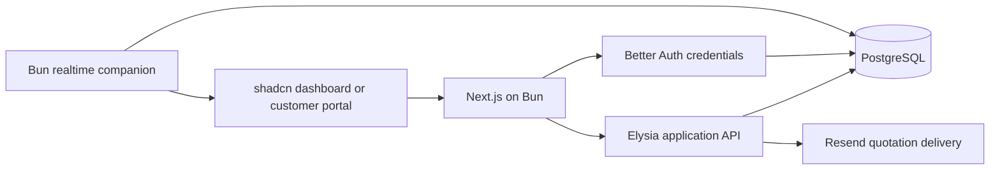

# Local delivery architecture and decisions

Accepted for implementation under the maintainer's autonomous delivery request and Linear DF-5.
The selected stack is Bun, Next.js App Router, Elysia, Better Auth credentials, Drizzle/PostgreSQL,
Resend and shadcn. The application runs locally; nothing is deployed.

## Components

Elysia owns `/api/v1`; Better Auth owns `/api/auth`. Resource permissions are checked on the server.
Self-signup grants Sales Rep only. Staff customer creation provisions a customer-bound credential
login with an emailed temporary password and required replacement. Customer access is
restricted to their quotes and excludes internal margins, costs, policy audit and unrelated stock.
Email access is a separate quote-scoped token exchanged for a restricted session, not a new account
login provider. Its digest and expiry are persisted; raw tokens are never logged.

The domain is one selling organization with many customer accounts. IDs are text UUIDs, with stable
synthetic seed IDs. Important relationships use foreign keys. Current quote lines are structured
snapshots; submitted revisions and order/invoice lines retain their commercial values, even after a
catalog change. Stocks/reservations and financial ledgers are relational records with checks and unique
operation keys. No Redis, broker, microservices or speculative persistence abstraction is required.

## Product rules selected for implementation

- INR paise and integer basis points. Apply variant/tier pricing, line discount, order discount,
  then per-line tax; half-up rounding. Promotions initialize a line discount rather than stack invisibly.
  Hardware tier factors are editable under Pricelists; new and edited drafts use them. Each variant
  is a canonical SKU with its own final catalog price, stock and descriptive attributes; accepted
  lines retain the SKU and price snapshot. Only configured product pairings qualify as upsell attribution.
- Line ceiling is minimum of customer-tier and category caps. Effective discount includes order
  discount. HIGH means max overage ≥ 500 basis points or summed overage ≥ 800; positive lower overage
  is MEDIUM; no overage is NONE. Approval authorizes the exact commercial revision, even when HIGH.
- Human HIGH approval follows the ordered `approvalChain` workspace setting, seeded as Manager then
  Finance. A reviewer approval advances to the next configured role; a return routes to the previous
  reviewer, while the first reviewer returns it to the representative for edits. Return/reject/edit/
  counter and automatic actions are audited. Changed commercial terms invalidate approval; comments do not.
- Confirmation locks the quote and relevant stock, creates one order per quote, reserves available
  units and creates initial billing within one database transaction. Unmet demand remains backorder.
  Acceptance does not reserve again; override preserves other orders and dispatched units.
- Every one-time line invoices at confirmation, including backorders. Recurring lines have separate
  invoices/schedules. One-time invoices use net14; recurring invoices are due at issue date.
- Actual UTC calendar-day proration, start-inclusive/end-exclusive periods, preserved month anchor.
  Quantity/same-cadence plan changes adjust the current period; cross-cadence change is rejected.
  Cancel stops future billing and credits unused service. No pause/resume or real cash refunds.
- Full-balance payments and applied credits reconcile the invoice. Unique logical effect keys protect
  against duplicate payments, due runs and stock movements. Financial status and fulfillment differ.
- Multi-currency/company, external payment rails and hosting are excluded from local delivery.

## UI and caching

Use shadcn dashboard-01 block composition, existing canonical DataTable and Lucide, with tweakcn's
Supabase theme. Use shadcn controls only; feature components compose those controls rather than create
alternative UI primitives. Keep tokens in global CSS, no arbitrary per-screen color system.

SWR handles client refresh and mutation invalidation. Private responses are never public cache
entries. All approval/stock/payment decisions re-read PostgreSQL. Realtime payloads include versions
and reconnect refetches authoritative state. Start with bounded lists and connection pools; add shared
caches/replicas only after a measured bottleneck and cross-instance invalidation tests.

## Alternatives, consequences and verification

One transaction avoids a distributed saga for this local workload. Structured revision snapshots
reduce mutable catalog joins while the relational ledgers retain durable integrity. A separate
realtime process accommodates actual sockets without mounting a second API inside Next.js. This
requires two local processes; startup commands must manage both and report health.

Migrations under `drizzle/` are additive. Rollback of the initial domain migration is only safe before
real data exists; later rollback uses a prior application version plus additive schema compatibility,
or a verified database backup. Do not drop shared data to undo a release.

Acceptance: real credential/DB integration, threshold and proration unit tests, transaction/duplicate
regressions, browser quote-to-cash and counter flows, socket restock/consolidation, PDF/XLSX checks,
CodeRabbit review, and a reproducible modest local workload. Performance figures are measured results,
not claims based on the runtime name. Larger-scale and production recovery work remains a later gate.
