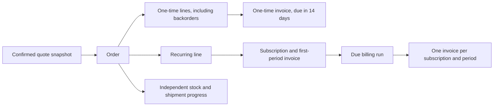

# Billing and cash reconciliation

The local hackathon uses a single PostgreSQL transaction for order confirmation, financial
snapshots and inventory coordination. The implementation lives in `src/features/billing/`.
Finance and administrators own billing mutations. Managers may read financial reports.
Sales representatives may download invoices only for their own quotes; customer sessions are
restricted to their own customer, and operations cannot download invoices.

## What confirmation creates



An invoice never mixes recurring and one-time streams. All money is USD integer cents, and
accepted quote lines retain their commercial snapshots. A rational price basis preserves the accepted
net charge and quantity, preventing penny drift across repeated quantity changes. No invoice or payment implies shipment.
The manual **Run due billing** operation catches up missed periods and is safe to retry.
It processes at most 200 due subscriptions per invocation, and at most 120 periods for one
subscription. A larger backlog requires explicit finance review or subsequent batches.

## Calendar and changes

Periods are UTC calendar dates, start-inclusive and end-exclusive. Monthly, quarterly and yearly
cadences preserve the original day anchor: January 31 bills on February 28 and then March 31.
Leap years use the real calendar. A period starts when the quote confirms. Recurring charges
are due at the start of each issued period.

The unused portion is `(new charge - old charge) × remaining days / actual period days`.
Cents use half-up rounding, including negative adjustments. For example, a $46 April charge
cancelled on April 16 produces a $23 credit for 15 unused days out of 30. Increasing the same
charge to $92 on April 16 produces a $23 additional invoice.

Quantity and plan changes take effect immediately. A plan change must retain the same cadence
and tax rate; cross-cadence conversion and pause/resume are intentionally unavailable in this
hackathon. Due periods are issued before a change is applied, preventing a late edit from
silently rewriting already-earned charges. Optimistic versions reject stale edits, while the
operation identity makes an exact retry return the existing outcome. Different input with the
same identity is rejected.

## Credits, payment and integrity

Cancellation keeps issued invoices and stops future periods. Unused billed service creates
credit notes linked to eligible source invoices. Credits cannot exceed that source's billed
value, including credits already issued. Credits first reduce that source's unpaid balance;
credit remaining after a prepaid invoice is preserved as available customer credit. This is
not a cash refund, and automatic application of available credit to a different invoice is
not implemented.

Payments record the entire outstanding amount with a reference, actor and unique operation
identity. Invoice row locks serialize concurrent payments, and database checks prevent
payments plus applied credits exceeding the invoice. A balance settled entirely by credit has
the stored status `PAID`; its invoice detail still separately displays paid cash and applied
credits so the distinction remains visible.

```mermaid
sequenceDiagram
  accTitle: A retry-safe full payment
  accDescr: Finance requests a payment. The database locks the invoice, reuses an identical operation if present, otherwise inserts the ledger and updates the balance atomically.
  participant F as Finance
  participant A as Elysia API
  participant D as PostgreSQL
  F->>A: Invoice, reference, operation identity
  A->>A: Validate session and finance permission
  A->>D: Begin; lock invoice
  A->>D: Look up operation identity
  alt Existing identical operation
    D-->>A: Existing payment and invoice
  else New operation
    A->>D: Insert full-balance payment
    A->>D: Update invoice; append audit record; commit
  end
  A-->>F: Reconciled invoice and ledger
```

## Reports and documents

`GET /api/v1/reports/financial` accepts `from`, `to`, `customerId`, `category`, and `status`.
Dates refer to each document's issue timestamp in UTC. Category selects whole invoices
containing that category; it does not allocate a mixed invoice's paid amount between categories.
Credit notes follow their own issue date and source invoice's category. A paid/unpaid status
filter selects invoices and excludes credit notes. Results are ordered by issue date and document
number. Narrow filters when more than 2,000 invoices or 2,000 credits match.

Net billed is invoice totals minus issued credit notes. Collected is recorded cash payment
amounts. Outstanding is invoice total minus payments and applied credits. These are distinct
metrics, and an available prepaid credit does not reduce another invoice automatically.

`format=pdf` creates a real text PDF; `format=xlsx` creates an Excel workbook with numeric
currency cells, frozen headers and the filter description. Formula-like customer strings stay
plain strings. Invoice PDF downloads use `/api/v1/invoices/:id/pdf`. Standard PDF fonts cannot
render all Unicode characters, so unsupported characters are visibly escaped as Unicode
code points rather than silently dropping names or failing the export.

## API mutations

| Route (under `/api/v1`) | Required body | Permission |
| --- | --- | --- |
| `POST /invoices/:id/pay` | `operationKey`, `reference` | Finance/admin |
| `POST /subscriptions/run-due` | None | Finance/admin |
| `POST /subscriptions/:id/change` | `operationKey`, `quantity`, optional `productId`, `reason`, `version` | Finance/admin |
| `POST /subscriptions/:id/cancel` | `operationKey`, `reason`, `version` | Finance/admin |
| `POST /health/nudge` | `operationKey`, `quoteId`, `reason` | Internal sales/finance/admin; representatives limited to their own deals |
| `POST /health/rules` | `anomalyBps`, `historyDays`, `approvalDays`, `overdueDays`, `staleDays` | Manager/admin |

Attention signals use live workspace facts: pending approvals, stale quotes, high discount risk,
overdue unpaid invoices and orders past their promised date. Discount anomalies compare the current
quote's average effective line discount with that representative's confirmed quotes in the configured
history window (default 90 days). Order and line discounts compound before averaging. Each quote
has equal weight in the historical average; at least three history samples are required. A gap
strictly greater than `anomalyBps` (default 1,000 basis points = 10 percentage points) triggers
an anomaly. A 22% current quote against three 8% confirmed quotes triggers the alert.

The configured thresholds persist in PostgreSQL. Every alert links to its specific quote, invoice
or fulfillment record. **Record nudge** appends a retry-safe follow-up to the deal owner's activity
feed; it does not send external email. Recent nudges remain visible on the health screen.
Dismissing a health signal hides it in the current view; **Refresh signals** restores signals
and fetches current facts.

## Verification and growth

Pure unit tests cover calendar boundaries, exact proration cents, invalid input and financial
artifact parsing. Database integration regressions cover confirmation retries, simultaneous
payments, invoice/credit conservation, cancellation, stale edits and due-run concurrency.

For a larger workload, run due batches from a scheduled worker using the same transactional
functions; keep unique period identities and row locks. Add measured query indexes and report
pagination/background exports before increasing report limits. Cache display aggregates only;
never make authorization, outstanding balances or payment decisions from a cached client copy.
