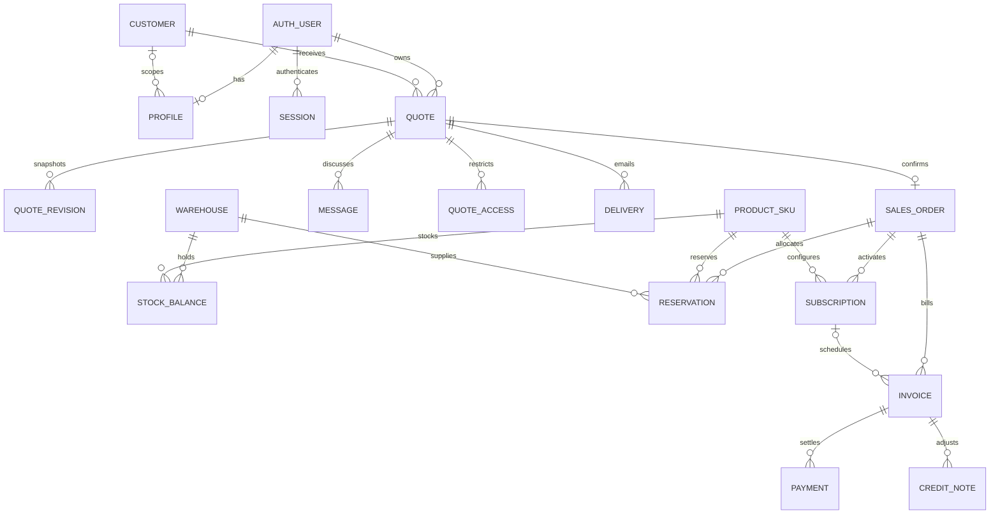

# Implemented data model

The schema lives in `src/lib/db/schema/`; committed migrations are under `drizzle/`. This diagram
shows the implemented relationships, including the distinction between credential sessions and
quotation-specific access. It does not introduce additional tables or service layers.

`AUTH_USER`, `SESSION`, account and verification records use the Better Auth schema. A missing
profile represents the explicitly selected self-signup Sales Rep behavior; seeded privileged and
customer accounts receive profiles. Customer profiles carry a customer ID. A quote-access token
never becomes an internal credential session.

## Commercial history

Quotes, revisions, orders and invoices store structured line snapshots in JSONB. Those snapshots
include the selected SKU, variant, price, cost, tax, quantity, discount and recurring cadence.
`QUOTE_REVISION` is a table; there is no separate quote-line or order-line table in this release.
Application boundary checks validate line identities and references. Accepted snapshots remain
unchanged when the catalog is edited.

Each quote has a current revision and an approved revision. Approval and customer counter actions
serialize against the quote row. Confirmation requires those revisions to match and creates a unique
order for that quote in the same transaction as initial reservations and billing.

## Stock and money integrity

- A stock balance is unique per warehouse/SKU and checks `onHand >= reserved >= 0`.
- Reservations are unique per order/warehouse/SKU and check `quantity >= shipped >= 0`.
- Stock movements retain operation identity, actor, reason and related order where applicable.
- Invoices retain unique document numbers and operation keys; settlements cannot exceed the total.
- Payments and credits retain unique operation keys. A credit belongs to its source invoice;
  cross-invoice credit applications are outside this release.
- Subscription rows retain current period boundaries, anchor day, cadence, quantity and original
  rational price basis. Period invoice identities prevent repeat billing after retries/restarts.
- Monetary values use integer cents; percentages use basis points. Pricing uses exact intermediate
  arithmetic and explicit rounding. Large values are bounded before PostgreSQL integer persistence.

Audit records preserve actor, entity, action, reason, revision and relevant changes. Delivery records
preserve intent and provider status; token material inside delivery intent is encrypted, while access
lookups use digests. Settings contain the editable discount, tier-price, health and upsell policies.

The application uses one selling organization. Customer IDs are ownership boundaries for customer
data, not separate SaaS tenants. Larger tenancy or accounting requirements need a new explicit
contract and migration, not assumptions from a diagram.
