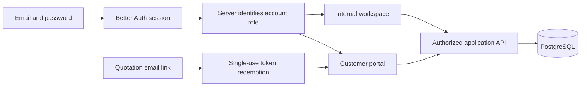

# Workspace and customer portal

## Decision

DealFlow360 uses the official shadcn `dashboard-01` composition and `login-03` form pattern with
the repository's Base UI / `base-nova` primitives. The maintainer selected shadcn-only UI and a
[tweakcn theme](https://tweakcn.com/editor/theme); the selected preset is
[Supabase](https://tweakcn.com/r/themes/supabase.json). Its light/dark color tokens are stored in
`src/app/globals.css`. The font uses the local system sans-serif stack so local builds do not
depend on a font download.

Feature components compose these native primitives; they do not introduce a competing button,
dialog, input, table, or navigation system. List screens use the existing shared DataTable.
The official sidebar source is split into shell, context, and menu files to retain the repository's
500-line file limit. Mobile state subscribes to the browser's media query through React's external
store API; the server snapshot is stable for hydration.

## Navigation and data

- `/login` and `/signup` use real Better Auth credentials. Hackathon signup creates a sales rep;
  customer roles are explicitly assigned. Successful sign-in uses a full navigation to discard
  the previous account's client data.
- The `(workspace)` route group provides the shared sidebar, account sign-out, breadcrumb,
  responsive header, loading state, and error recovery. An authenticated server leaf under Suspense chooses the correct
  destination and passes the actor to the shell; API handlers independently authorize every operation.
- Interactive internal screens share the `/api/v1/workspace` SWR key and configured JSON fetcher.
  Mutations revalidate their affected collection. This bounded hackathon snapshot simplifies
  navigation; growth requires paginated resource endpoints as documented in the system decision.
- The separate portal exposes public quotation fields, line-specific messages, counterproposals,
  and approval-aware confirmation. Costs, margins, internal notes, and risk snapshots are absent
  from the public quotation contract.
- The email token is redeemed once for an HttpOnly scoped session, then removed from browser
  history. Portal sign-out revokes that session. Confirmation sends the reviewed revision;
  the server rejects stale or unapproved terms.

## Verification

`playwright/e2e/identity.spec.ts` exercises real sign-in, invalid credentials, signup, logout,
protected navigation, and a 390px mobile sidebar. `playwright/e2e/portal.spec.ts` follows a customer
through a line-specific conversation, counterproposal, and order confirmation. `test/integration/portal.regression.test.ts`
checks cross-customer isolation, single-use redemption concurrency, public-field redaction,
confirmation idempotency, and session revocation against the real API and test database.
`playwright/e2e/catalog.spec.ts` verifies create, search, and edit through the real catalog UI.
`playwright/e2e/quotation-journey.spec.ts` covers the hero pricing scenario, upsell, two sequential
approval rounds, customer confirmation, and exact invoice/warehouse outcomes.
The final handoff records which commands passed.
