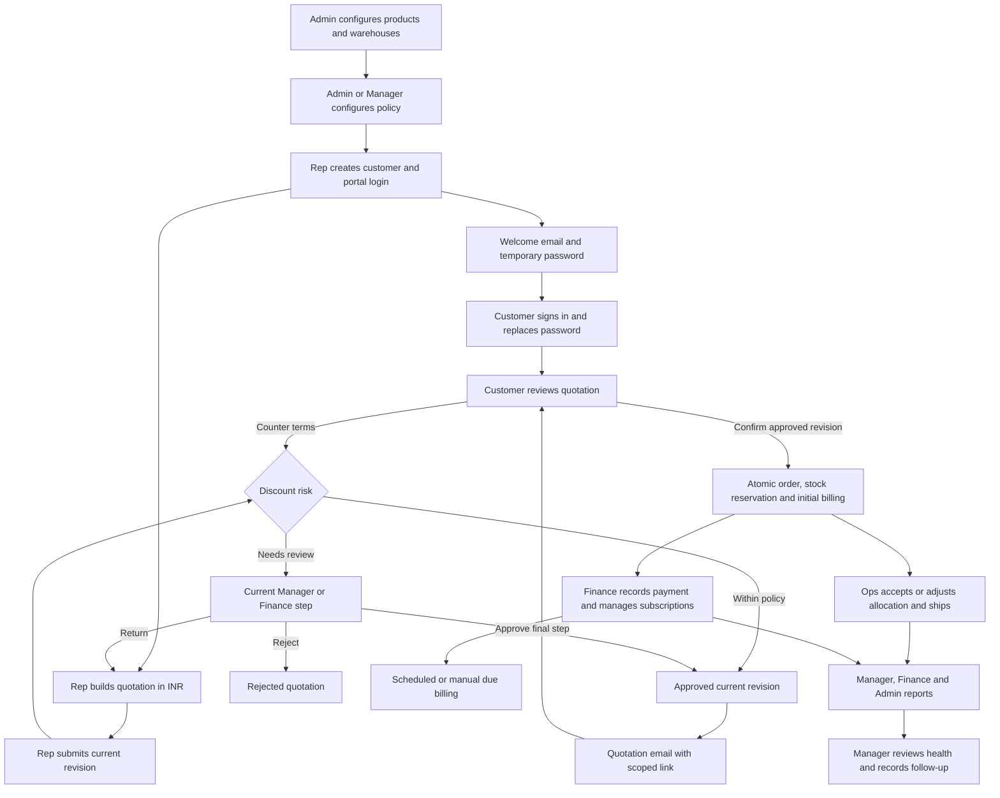
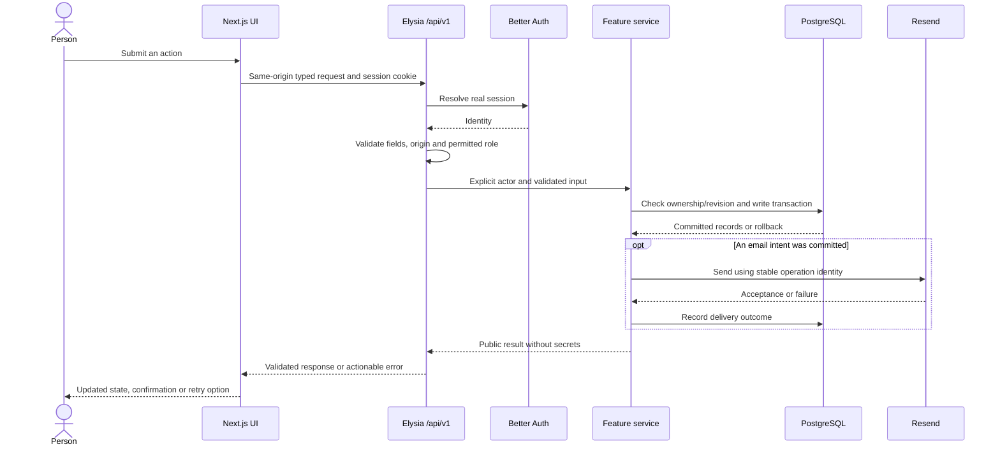

# DealFlow360: the complete project flow

Start here to understand how the implemented application works end to end. These guides describe
the code, including limitations; they do not promise that every possible case has been exercised.
Currency is INR throughout. Numerical examples are synthetic and depend on the configured policy.

## Read by workflow

| Guide | What it explains |
| --- | --- |
| [Identity and administration](identity-and-administration.md) | Signup, login, logout, customer onboarding, temporary passwords, customer CRUD, catalog, variants, promotions, settings and role navigation |
| [Quotations and negotiation](quotations.md) | Builder, tiers, pricing, discounts, recommendations, board, approval/rejection/return, quotation email, portal links, messaging, counters and confirmation |
| [Fulfillment](fulfillment.md) | Warehouses, stock setup/receipts, allocation, reservations, backorders, overrides, acceptance, dispatch and live stock |
| [Billing and reporting](billing-and-reporting.md) | Initial invoices, subscriptions, renewal scheduling, changes/cancellation/proration, credits, payment, documents, filters and health actions |
| [Architecture](../architecture/README.md) | API boundaries, database invariants, authorization, runtime, delivery and migration decisions |

## One complete business journey

Example: Admin creates a one-time service priced at ₹10,000 with 18% tax. Rep adds quantity 1
for a Gold customer and applies a 5% line discount, with no order discount. Under defaults this
is inside the Services and Gold ceilings: subtotal ₹9,500, tax ₹1,710, total ₹11,210. Submission
auto-approves that revision and attempts email. The customer confirms; because the service is
not stockable, there is no physical reservation to ship. The order's one-time invoice is
₹11,210. Finance records full settlement, leaving ₹0 outstanding. A hardware line would also
create reservations; a recurring plan would create separate recurring billing. See the linked
guides for multi-line examples and the exact rounding, risk and billing rules.

## What each person does

| Role | Typical day | Cannot do |
| --- | --- | --- |
| Sales Rep | Create customer; build, revise and submit own quote; send approved quote; inspect fulfillment and own invoices/subscriptions | Approve, accept for customer, receive/ship stock, record payment, change policy or catalog |
| Manager | Manage customers and policy; review current approval step; monitor deals, reports and health | Write quote terms, execute stock operations, record payments |
| Finance | Review current finance approval step; manage invoices/subscriptions; run billing and reports | Stock access, customer creation, quotation authoring, customer acceptance |
| Ops | Read quotations; inspect stock; receive, allocate and ship orders | Financial datasets/actions, customer setup, reports or approval decisions |
| Admin | Configure catalog, warehouses and policy; manage customer directory; inspect quotations and reporting | Quote authoring/sending, approval, customer impersonation, dispatch/restock, payments, subscription mutation or health nudges |
| Customer | Replace initial password; review own portal quotes; ask questions, counter and confirm approved terms | Staff workspace or another customer's records |
| Quote-link visitor | Redeem a one-time emailed access link and work on that exact quotation | Another quotation, even belonging to the same customer |

The [shared policy](../../src/lib/domain/permissions.ts) governs role access. Resource ownership,
current revision and current approval step add further restrictions. A hidden button is only a
UI affordance; the API independently enforces these rules. For streamed pages, the 403 screen
can arrive inside a previously started HTTP 200 response; API denials return HTTP 403.

## How a user action travels through the project

Authentication endpoints live under `/api/auth` and use Better Auth's own handler. Application
endpoints live under `/api/v1`, composed in [server/api.ts](../../src/server/api.ts). The Next.js
[catch-all](../../src/app/api/v1/[[...slugs]]/route.ts) delegates directly to Elysia. Business code
lives in feature controllers, query modules and transactional services; there is no additional
generic MVC repository layer. The browser uses Eden Treaty and SWR. The companion Bun process
supplies authenticated stock WebSockets and optional recurring billing.

## Feature and test coverage index

These links identify executable coverage. Actual results and environment belong in the final
implementation handoff; a test file's existence is not proof that a run passed.

| Feature or boundary | Guide | Primary executable evidence |
| --- | --- | --- |
| Signup/login/logout and responsive shell | Identity | [Identity browser](../../playwright/e2e/identity.spec.ts) |
| Origins, sessions and mutation CSRF | Identity | [Auth origin integration](../../test/integration/auth-origins.regression.test.ts) |
| Role navigation and forbidden deep links | Identity | [Role browser matrix](../../playwright/e2e/role-access.spec.ts) |
| Customer login creation, first password change and mail retry | Identity | [Onboarding browser](../../playwright/e2e/customer-onboarding.spec.ts), [integration](../../test/integration/customer-onboarding.regression.test.ts) |
| Customer tiers, contact edits and protected deletion | Identity | [Customer browser](../../playwright/e2e/customers.spec.ts), [lifecycle integration](../../test/integration/customer-lifecycle.regression.test.ts) |
| Catalog products and variants | Identity | [Catalog browser](../../playwright/e2e/catalog.spec.ts) |
| Quotation builder, tier prices, discounts and totals | Quotations | [Quotation journey](../../playwright/e2e/quotation-journey.spec.ts), [pricing regression](../../test/unit/quote-rules.regression.test.ts) |
| Raw numeric editing and invalid discount handling | Quotations | [Number-input browser](../../playwright/e2e/number-input.spec.ts) |
| Purchase recommendations and add-to-quote | Quotations | [Recommendation browser](../../playwright/e2e/quote-recommendations.spec.ts) |
| Board transitions and revision conflicts | Quotations | [Board integration](../../test/integration/quote-board.regression.test.ts) |
| Configured approval order and return routing | Quotations | [Approval integration](../../test/integration/approval-workflow.regression.test.ts) |
| Quotation mail intent, failure and token lifecycle | Quotations | [Email integration](../../test/integration/email.regression.test.ts) |
| Customer discussion, counter, risk re-approval and acceptance | Quotations | [Portal browser](../../playwright/e2e/portal.spec.ts), [hero journey](../../playwright/e2e/quotation-journey.spec.ts) |
| Customer/Rep ownership and Admin denials | All domains | [Workspace access regression](../../test/integration/workspace-access.regression.test.ts) |
| Warehouses, reservations, receipt, override and shipment | Fulfillment | [Inventory integration](../../test/integration/inventory.regression.test.ts), [browser](../../playwright/e2e/inventory.spec.ts) |
| Live stock authentication and cross-tab updates | Fulfillment | [Socket integration](../../test/integration/inventory-socket.test.ts), [browser](../../playwright/e2e/inventory.spec.ts) |
| Invoices, payment, cancellation, credits and downloadable documents | Billing | [Billing browser](../../playwright/e2e/billing.spec.ts), [integration](../../test/integration/billing.regression.test.ts) |
| Due scheduler and calendar/proration correctness | Billing | [Scheduler regression](../../test/integration/billing-scheduler.regression.test.ts), [calendar tests](../../test/unit/billing-rules.test.ts) |
| Financial/sales reports, filters and limits | Reporting | [Sales report integration](../../test/integration/billing-sales-report.regression.test.ts), [row-cap regression](../../test/integration/billing-report-cap.regression.test.ts) |
| Reports for every role, totals, filters, exports and session expiry | Reporting | [Report browser matrix](../../playwright/e2e/reports.spec.ts) |
| Customer health rules and recorded nudges | Reporting | [Health rules](../../test/unit/billing-health.regression.test.ts), [billing integration](../../test/integration/billing.regression.test.ts) |
| INR UI and PDF/XLS labels | All domains | [Money regression](../../test/unit/money.regression.test.ts), [document artifacts](../../test/unit/billing-documents.test.ts) |
| Theme, tables and compiled styles | Shared interface | [Theme rules](../../test/unit/theme-options.regression.test.ts), [table regression](../../test/unit/data-table.regression.test.ts), [stylesheet browser](../../playwright/e2e/stylesheet.spec.ts) |
| API contracts, typed client and Next adapter | Architecture | [OpenAPI regression](../../test/unit/openapi-contract.regression.test.ts), [client regression](../../test/unit/quote-client.regression.test.ts) |

## Running and verifying the journey

Follow the [repository setup](../../README.md) and [verification guide](../engineering/verification.md)
for local environment contracts. Apply migrations before starting updated code. Use only a dedicated
local database ending `_test` for tests; tests reset that database and must never target development
or production data. `bun run check:full` runs static checks, unit/regression/integration tests,
production build and Playwright. Browser email uses a loopback Resend substitute, not real inboxes.

For a walkthrough, first use Admin to prepare products and warehouse stock rows; use Ops to receive
stock; use Rep to create the customer and quote; use the required reviewers; then use customer
credentials or a scoped link to negotiate/accept; finish with Ops dispatch and Finance billing.
Use separate browser contexts for concurrent roles. Never share a staff session as a customer proxy.

## Current limits that matter during a demo

- INR is the only implemented currency. No live exchange-rate provider, Redis FX cache or
  currency snapshots exist; changing a symbol does not perform a conversion.
- Customer portal discussion polls periodically. Staff conversation has no complete reply composer
  or equivalent dedicated polling; do not present it as complete two-way instant chat.
- `SENT` email means provider acceptance; actual inbox delivery is a separate live check.
- Expired/changed-address onboarding invitations need account recovery that is not yet implemented.
- Payments record full settlement; there is no external payment gateway, partial-payment entry or
  automatic cash-refund/future-credit application workflow.
- Billing automation requires the companion process and its explicit configuration. The existing
  local WebSocket URL setup is not a production HTTPS deployment design.
- See each domain guide for record caps, date-sensitive behavior, retry identities and current
  policy configuration. The suite demonstrates selected end-to-end scenarios, not exhaustive proof
  of every possible user/data combination.

## Keep this guide evolving

The repository agreement requires every flow change to update its guide, this index, affected
diagrams/examples, and relevant tests in the same task. Follow [.agents/docs.md](../../.agents/docs.md).
When a domain grows, split its guide and add links here; do not let the overview become a single
oversized diagram or an unrelated release log. Verify examples against current behavior, remove
obsolete claims, and retain honest distinctions between implemented, tested and planned features.
