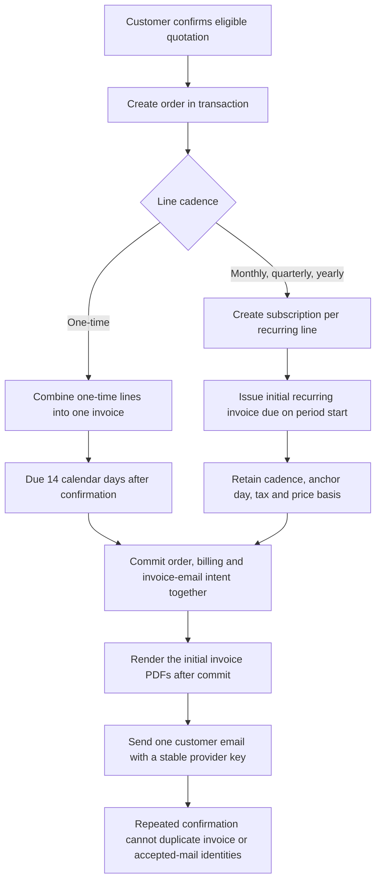
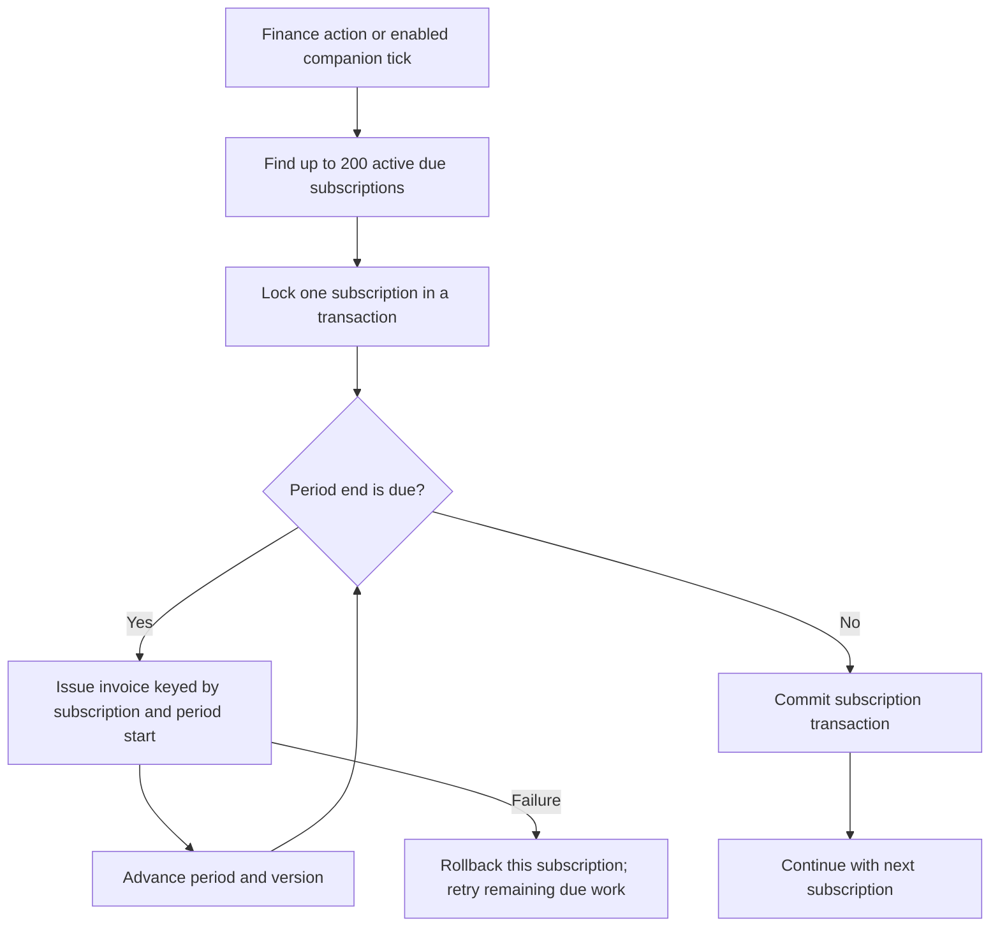
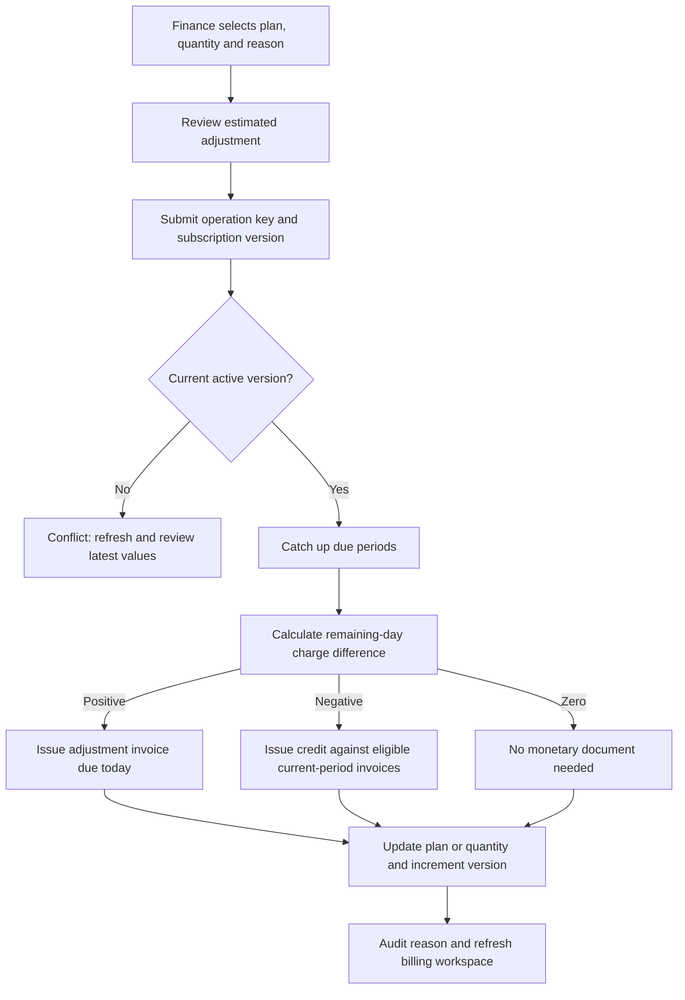
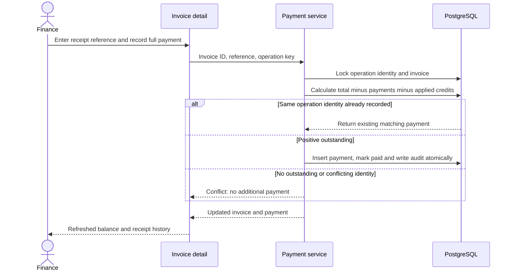
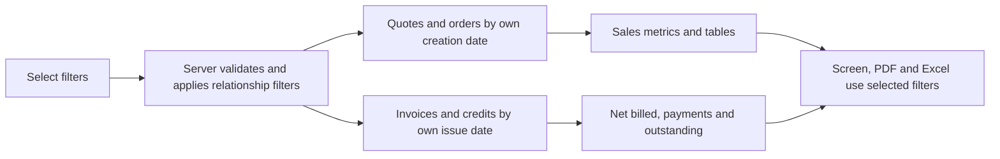
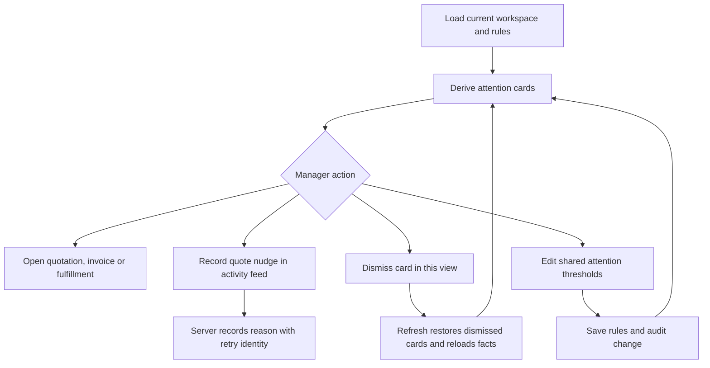

# Billing, subscriptions, reports, and deal health

This guide describes the implemented flows, with fictional examples. All amounts are INR:
the UI uses ₹, exports use INR where required by the document font, and legacy `*Cents`
fields store integer paise. There is no exchange-rate conversion or multi-currency ledger.
See [currency](../architecture/currency.md) and [billing architecture](../architecture/billing.md).

## Roles and entry points

The shared [permission matrix](../../src/lib/domain/permissions.ts) governs navigation and
API authorization; ownership restrictions also apply to individual records.

| User | Available flow |
| --- | --- |
| Sales representative | Read their scoped invoices and subscriptions; download their invoice PDFs. |
| Sales manager | Read invoices/subscriptions, use Reports and Deal health, record nudges, and configure attention rules. |
| Finance | Read billing, record full payments, change/cancel subscriptions, run due billing, and use Reports. |
| Administrator | Reporting and workspace setup; billing data is available through the workspace read permission, but finance mutation rights are not implied. Attention-rule API setup is permitted; Deal health navigation is manager-only. |
| Customer | Invoice PDF access requires that the invoice belongs to their customer account; no finance mutation permission. |
| Operations | Fulfillment work; no invoice/payment/subscription/report authority. |

Screens are `/invoices`, `/invoices/:id`, `/subscriptions`, `/reports`, and `/health`.
Invoice detail opens as a dialog, including when entered by a deep link. Hiding a button is
not the authorization boundary: [billing routes](../../src/features/billing/routes.ts) enforce
permissions and invoice PDF ownership on the server.

## Order confirmation creates billing

The customer confirms eligible quotation terms through the portal. The order-confirmation
transaction calls [createOrderBilling](../../src/features/billing/creation.ts). Billing uses
the confirmed order's price snapshots, including its discounts and taxes. A later catalog
price change does not rewrite already-issued invoices.

Example: an order contains a ₹10,000 setup service and a ₹1,000 monthly care plan, both
with 18% tax. Confirmation on September 6 creates a ₹11,800 one-time invoice due
September 20 and a ₹1,180 recurring invoice due September 6 for September 6–October 6.
The end date is exclusive. Two recurring lines produce two subscriptions, not one blended
subscription. One-time billing covers the confirmed one-time order even if physical units
are backordered; it is not shipment-triggered invoicing.

The invoice types are `ONE_TIME`, `RECURRING`, and `ADJUSTMENT`. An invoice with zero
outstanding starts `PAID` without creating a fictional payment record.

After that transaction commits, DealFlow360 sends the customer one email with the initial invoice
PDF or PDFs attached. It uses the same stored-invoice renderer as the finance download, so catalog
changes cannot reprice the attachment. The delivery record snapshots the confirmation recipient and
the initial invoice IDs: a later recurring renewal, adjustment, or credit never changes this email's
attachments. Provider acceptance marks it `SENT`; a configuration, rendering, or provider failure
marks it `FAILED` without rolling back the order. Repeating the confirmation request retries the
same durable delivery identity and provider idempotency key. This records an attempted delivery,
not proof of inbox receipt.

## Subscription renewal and automatic billing

Monthly, quarterly, and yearly mean 1, 3, and 12 calendar months. Calculations use UTC
calendar dates, actual month length, and the original anchor day. January 31 renews at
February's last day and then returns to March 31. Leap years are handled by the calendar
calculation, rather than assuming every month contains 30 days.

Finance can select **Run due billing** on Subscriptions. Automatic execution is supplied
by the [companion process](../../scripts/realtime.ts) when `AUTOMATIC_BILLING=true`:
the [scheduler](../../src/features/billing/scheduler.ts) runs on startup and every 60 seconds.
Starting Next.js alone does not establish that the companion scheduler is running.

Missed ticks do not mean lost invoices: the stored period dates determine what is due.
Each subscription has a transaction, so a failure does not undo earlier subscriptions
already committed by that run. A maximum of 120 catch-up periods per subscription requires
finance review rather than unbounded processing. A batch of 200 returns `moreMayRemain`;
another run can process remaining work. Cancelled subscriptions do not renew. Scheduler
state tracks last run, last success, and failure; it is not a substitute for supervising the
companion process in deployment.

## Change a subscription

Finance opens a subscription, selects a plan, edits whole-number quantity from 1 to 10,000,
enters a reason of 3–500 characters, reviews the estimate, and selects **Apply change**.
An alternate plan must be active and have the same billing cadence and tax rate. This flow
does not support changing monthly service to annual service in place.

The UI estimate comes from [subscription preview](../../src/features/billing/subscription-preview.ts).
The server [change service](../../src/features/billing/service.ts) locks the subscription,
checks its version, catches up any due periods, and calculates the authoritative adjustment.
If the stored period is already due, the UI explains that reconciliation must happen first
instead of inventing an estimate. Invalid quantities or unsafe monetary values cannot enable
the mutation.

For unchanged plans, quantity changes preserve the original rational price basis (original
period net / original quantity), including the negotiated discount. Repeated changes do not
compound rounding drift. Selecting a different plan instead uses that product's current
catalog unit price. Existing quotation approval configuration still governs quotation
approval; subscription changes are finance operations and do not create a new quotation
approval cycle.

The rule is `(new period total − old period total) × remaining days / period days`, rounded
half-up to integer paise. Example: September 1–October 1 is 30 days. On September 16, a
tax-inclusive ₹1,000 period becomes ₹1,600. Fifteen days remain, so the adjustment invoice
is ₹300. The original invoice is preserved. On the final boundary, the server first moves
to the next due period, so “zero remaining days” in a calculator is not a promise of a free
new period when changing an overdue subscription.

## Cancellation and credits

Finance enters a reason and selects **Cancel and credit unused service**. Cancellation
takes effect today, after catching up due periods. It sets the subscription to `CANCELLED`,
increments its version, retains invoice history, and prevents future recurring runs.

Example: cancelling a ₹1,000 tax-inclusive 30-day period with 15 unused days creates a
₹500 credit. If the source invoice is unpaid, ₹500 is applied against its outstanding
balance, leaving ₹500 to collect. If it was fully paid, the ₹500 remains available customer
credit. No cash refund has been issued.

Credits are bounded by eligible billed service in the current period, including adjustment
invoices. Applied credits cannot make the invoice outstanding negative. Credit notes have
their own identities and retain reasons. There is currently no UI/API here for refunding
cash or allocating available credit automatically to a later invoice; available credit is
a recorded balance, not evidence that money has been returned.

## Invoice review, payment, and PDF

Users with invoice access search the register, optionally narrow it to All, Open, Past due
or Settled, and open an invoice. The register marks an unpaid invoice past due once its due
date has passed, and reports how many days late it is. Detail shows its source order, line
amounts net of each line's discount so they sum to the subtotal, tax, recorded payments,
applied credits, and outstanding balance. Credit entries show both applied and available
portions. Finance enters a bank or
receipt reference (3–100 characters) and selects **Record full payment**.

Example: ₹11,800 billed minus ₹2,000 applied credit leaves ₹9,800. Recording full payment
adds ₹9,800 to the payment ledger and marks the invoice paid. This is manual recording of
a received payment, not a payment-gateway charge. Partial-payment entry is not implemented
by this endpoint. Retrying the same operation key and matching input returns the existing
payment; reusing it for another invoice/reference/actor produces a conflict. The UI generates
an operation key for a submission; separate clicks are not described as the same retry.

**Download PDF** retrieves the invoice using authenticated access, with a private/no-store
response and an attachment filename based on the invoice number. The PDF reflects the
stored invoice and current recorded payment/credit totals; it does not reprice from catalog.
Confirmation email attachments call that same PDF renderer directly after the order commits; they do
not expose an invoice URL or weaken the authenticated download endpoint.

## Reports and export semantics

Managers, finance, and administrators open Reports. The screen combines sales records and
financial records. It can report quotations before any invoice exists, so a draft quote
does not disappear from sales reporting merely because it has not become an order.

| Filter | Meaning |
| --- | --- |
| From / To | Inclusive UTC dates: quote creation for quotes, order creation for orders, invoice/credit issue for financial rows. A reversed range is rejected. |
| Customer | Records linked to the selected customer. |
| Representative | Quotation owner, including the owner of the source quote for orders/invoices. |
| Team | Customer's team value, not a separate employee-team relationship. |
| Approval status | Current quote state; “Approved current terms” means approved revision equals current revision. |
| Category / Product | Select whole records containing a matching line. If both are chosen, the same line must match both. |
| Payment status | Paid/unpaid invoice rows only; does not filter sales records and excludes standalone credit rows when selected. |

Example: choose Care Plans. An order with ₹10,000 hardware and ₹1,000 care qualifies
because it contains care, and its whole order amount is reported; this is not a ₹1,000
line-only revenue subtotal. Choose September 1–30: an August quotation confirmed as an
order in September can appear in orders but not quotations. A credit issued in September
can appear even when its invoice was issued in August, provided the other relationships
match.

Sales metrics include quotation count, confirmed-order count, ordered amount, average
completed approval time, and the most-upsold product by units on confirmed orders. Top
upsell counts only lines marked as upsells and respects product/category filters. Approval
timing uses revision-specific audit history: auto-approval contributes zero hours, HIGH
risk waits through the finance step, and incomplete/returned/rejected cycles do not add a
successful approval duration. Missing history is unknown rather than an invented zero.

Financial totals are: net billed = invoices minus credit notes; payments collected =
recorded payments on selected invoices; outstanding = totals minus paid and applied credits,
floored at zero per invoice. This is not a cash-flow report filtered by payment receipt date.
Standalone credit rows display APPLIED or AVAILABLE. Data limits require narrower filters
above 2,000 invoices, 2,000 credits, 2,000 quotes, 2,000 orders, or 20,000 approval events;
the endpoint rejects oversized selections rather than silently truncating totals.

Report filters start collapsed. Select **Show filters** to edit them and **Hide filters** to
collapse them again; the header shows the active filter count. Collapsing preserves selections,
results, validation errors and export scope. For example, selecting a customer then hiding filters
still shows and exports only that customer's matching records.

PDF and Excel downloads use the active filter query. The export description explains date
and whole-record matching semantics. Excel money columns remain numeric with INR headings, and
customer-entered text is treated as text.

PDF uses a landscape executive summary with INR KPI cards, financial comparison bars and
quotation-status counts, followed by filter/interpretation notes and separate quotation, order
and financial registers. Charts use the same filtered records as the tables; they are not a
conversion funnel. Negative net billing is plotted left of zero; credit totals remain positive
and reduce net billed. Empty selections have explanatory text. Tables wrap long cells across
pages, repeat headings and show page numbers. The PDF generation time is shown in UTC.
Download actions are disabled when the report is
unavailable, invalid, refreshing, or failed. A failed refresh hides cached report results rather
than presenting old totals as current; the retry/sign-in state remains visible. Sources:
[financial report](../../src/features/billing/reports.ts),
[sales report](../../src/features/billing/sales-report.ts),
[approval timing](../../src/features/billing/approval-metrics.ts), and
[document generation](../../src/features/billing/documents.ts).

## Deal health and follow-up

The manager opens Deal health to turn current workspace facts into attention cards. These
are threshold signals, not a prediction model or a separate customer credit score.

| Signal | Default trigger | Example and next action |
| --- | --- | --- |
| Approval waiting | Pending approval and 2 days since quote update | An approval unchanged for 3 days links to quotation review. |
| Stale deal | Draft, sent, or negotiating; 7 days since update | A sent quote untouched for 8 days links to pipeline follow-up. |
| Unusual discount | More than 1,000 basis points above the same rep's historical average, with at least 3 confirmed quotes in 90 days | History averages 5%; a current 16% average triggers review. |
| Discount risk | Current quote risk HIGH and not confirmed/rejected | Open line pricing and configured approval route. |
| Overdue payment | Positive outstanding and at least 1 day since due date | A due invoice remains unpaid; review collection, not shipment status. |
| Delivery at risk | Promised date passed and order not fulfilled | Open fulfillment to review reservations/backorders. |

The anomaly average combines line and order discount multiplicatively and averages lines
equally, not by their monetary value. It compares the representative's confirmed history,
not just this customer's purchases. A quote may have several different attention cards.

**Record nudge** writes an auditable `HEALTH_NUDGE` for the deal owner in the activity feed.
It does not send an email/SMS or prove that the representative has read it. Replaying the
same actor/operation identity with the same quote and reason is idempotent; changed input
conflicts. **Dismiss** is local to this mounted view and does not resolve the underlying
business issue. **Refresh signals** clears dismissals and reloads workspace facts.

Attention-rule values are whole numbers: stale days 1–90, overdue/approval days 1–60,
history days 1–365, anomaly threshold 0–10,000 basis points. Manager/admin settings
permission is required by the save API. Changing these attention thresholds does not change
commercial approval thresholds. Sources: [health calculation](../../src/features/billing/health.ts),
[health screen](../../src/features/billing/health-workspace.tsx), and
[health API](../../src/features/billing/health-routes.ts).

## Verification map and reviewer walkthrough

These links identify executable coverage in the repository. Their presence is not a claim
that every test ran successfully in this documentation task; use the implementation handoff
and test-run output for actual execution evidence.

| Coverage | Existing source |
| --- | --- |
| Real browser: finance login, full payment, invoice PDF, quantity change, cancellation, report filters, PDF/XLS downloads | [billing browser journey](../../playwright/e2e/billing.spec.ts) |
| All six roles and signed-out report access; persisted-record totals, all nine filters, empty/invalid ranges, PDF/XLSX parsing, and expired-session refresh | [report browser matrix](../../playwright/e2e/reports.spec.ts) |
| Transactions: confirmation billing, payment/credit concurrency, duplicate operations, version conflicts, cancellation, catch-up, zero balances | [billing integration regressions](../../test/integration/billing.regression.test.ts) |
| Companion startup/restart and recurring invoice deduplication | [scheduler integration](../../test/integration/billing-scheduler.regression.test.ts) |
| Draft reporting, owner/team/product filters, record-specific dates, matching exports | [sales report integration](../../test/integration/billing-sales-report.regression.test.ts) |
| Filters applied before row caps | [report-cap integration](../../test/integration/billing-report-cap.regression.test.ts) |
| Month anchors, leap years, UTC days, integer proration and balances | [billing rules](../../test/unit/billing-rules.test.ts) |
| Approval revision timing and multi-step completion | [approval metric tests](../../test/unit/billing-approval-metrics.test.ts) |
| Valid/invalid subscription previews and disabled exports | [UI regressions](../../test/unit/billing-review.regression.test.tsx) |
| Real document bytes, pagination, numeric spreadsheets and text handling | [document tests](../../test/unit/billing-documents.test.ts) |
| Confirmation invoice attachment, durable retry identity and provider acceptance | [email integration](../../test/integration/email.regression.test.ts) |
| Historical discount comparisons, fulfilled-order exclusion, collection signal wording | [health regressions](../../test/unit/billing-health.regression.test.ts) |

For a manual demonstration, create and confirm a mixed one-time/recurring quotation, then
sign in as finance and find its invoice. Record a bank reference, download the PDF, change
the recurring quantity with a reason, and inspect the adjustment. Cancel service and inspect
the credit without claiming a cash refund. In Reports, filter by its customer and compare
the screen with both exports. As manager, inspect a stale quote signal, record a nudge,
observe the activity entry, dismiss it, and refresh to demonstrate that dismissal is local.
Negative checks should include a representative attempting finance mutations, a stale
subscription version, reused operation identity with changed data, and an unauthorized
invoice PDF request. These browser actions require suitable seeded records and must not be
represented as already exercised merely because they are described here.
