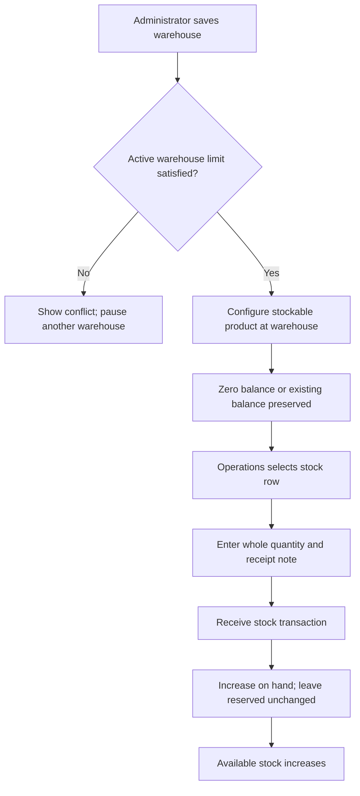
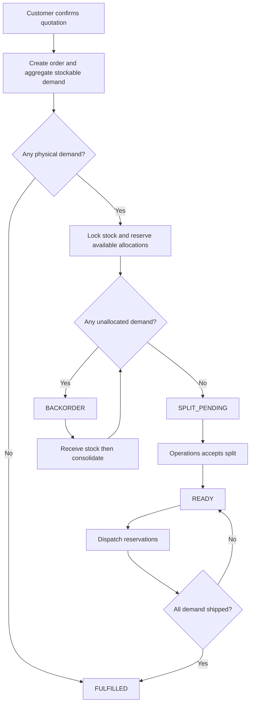
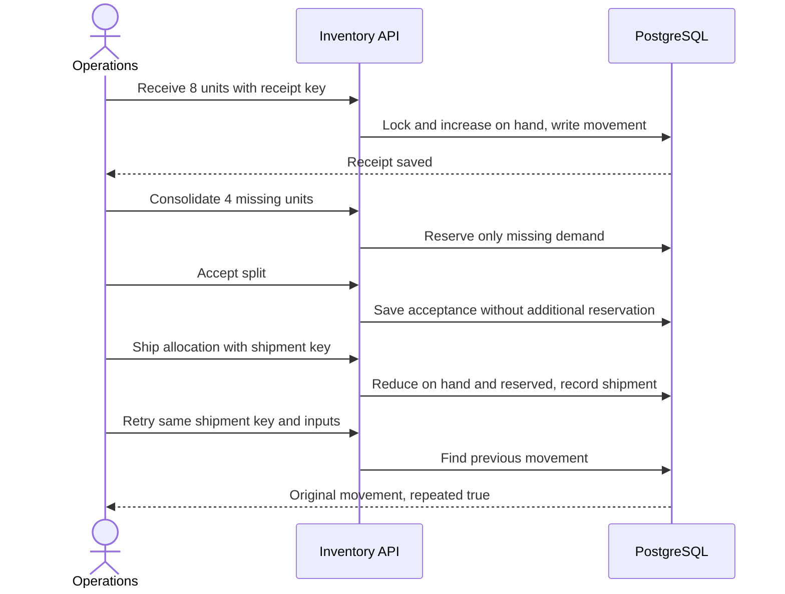

# Inventory and fulfillment flows

This guide describes the implemented stock ledger and order dispatch workflow. Quantities are
whole units. Monetary examples elsewhere in the application use INR; the **relative shipping
score is not a rupee charge** and does not change an invoice total.

## Roles and entry points

| Actor | Read stock | Configure warehouses/stock locations | Receive, accept, override, consolidate, ship |
| --- | --- | --- | --- |
| Sales representative | Yes | No | No |
| Sales manager | Yes | No | No |
| Operations | Yes | No | Yes |
| Administrator | Yes | Yes | No |
| Finance | No | No | No |
| Customer | No internal inventory access | No | No |

The [shared permission map](../../src/lib/domain/permissions.ts) governs API access independently
of visible buttons. Representatives and managers inspect fulfillment; Operations performs physical
stock actions. Administrator setup access does not imply dispatch permission. Customers trigger
initial reservation by confirming an eligible quotation through the customer workflow.

The fulfillment queue is `/fulfillment`; select an order to open its detail dialog. A direct detail
route also exists at `/fulfillment/[id]`. Representatives, managers, and Operations see stock balances
below the queue; only Operations can select a stock row to receive a delivery. Administrators use
the stock section of `/settings` to configure warehouses and stock locations. The same
[inventory screen](../../src/features/inventory/inventory-screen.tsx) supplies both sections.

There is no separate Inventory navigation item. The legacy `/inventory` URL redirects an
Administrator to `/settings` and other authorized stock readers to `/fulfillment`. An unauthenticated
visitor goes to `/login`; an account requiring a password change goes to `/change-password`;
Finance is denied. These checks run on the server, as do the stock API permissions.
Sources: [fulfillment composition](../../src/features/inventory/fulfillment-screen.tsx),
[settings composition](../../src/features/shell/settings.tsx),
[legacy route guard](../../src/app/(workspace)/inventory/page.tsx).

## Configure a warehouse and a stock location

An Administrator enters a name, a shipping score multiplied by 100, a replenishment threshold,
and whether the warehouse accepts new allocations. For example, entering `120` sets score `1.2`,
not ₹120. A new warehouse dialog starts paused. At most three warehouses can be active because
the exact planner is deliberately bounded; at most 100 warehouses can be configured.

The Administrator then chooses a stockable product and a warehouse in **Configure stock**.
This creates a unique product/warehouse balance with zero on hand and zero reserved. Repeating
configuration preserves the existing balance; it does not reset stock. The next step belongs to
Operations: record a delivery receipt. Configuring a location never manufactures physical units.

Warehouse names are 1–100 characters; shipping score storage accepts integers 0–100000;
thresholds accept integers 0–1000000. The stock-location API rejects non-stockable products and
missing warehouses. A fourth active warehouse produces a conflict without partially saving it.
Pausing excludes a warehouse from new automatic allocations; it does not erase reservations or
physical balances. No warehouse-delete or stock-location-delete flow is exposed here.

Sources: [warehouse service](../../src/features/inventory/warehouse.ts),
[warehouse form](../../src/features/inventory/warehouse-settings.tsx),
[stock setup](../../src/features/inventory/stock-setup.tsx),
[API validation](../../src/features/inventory/routes.ts).

## Receive physical stock

Operations opens a stock row, enters **Quantity received** and **Receipt note**, then selects
**Receive stock**. Quantity must be an integer from 1 to 1000000; the note is 3–500 characters.
A successful receipt creates a `RESTOCK` movement and audit entry, increments the balance version,
and displays that backorders can now be consolidated. Receipt does not allocate backorders by itself.

Example: a warehouse has 12 on hand and 8 reserved, so 4 are available. Receiving 6 makes on hand
18, reserved 8, available 10. If its threshold is 10, the balance still shows **Restock suggested**:
the comparison is `available <= threshold`, including equality.

The receipt requires an already configured stock location. A missing location returns 404 with an
instruction to configure it first. The operation key survives a failed retry within the open form;
an identical retry returns the original movement without increasing stock again. Reusing that key
with different quantity, product, warehouse, reason, or movement kind returns 409. After success a
new submission gets a new key and represents another delivery, even if the values are identical.

Sources: [receipt form](../../src/features/inventory/restock-form.tsx),
[receipt transaction](../../src/features/inventory/mutations.ts).

## Confirmation, planning, and reservation

Quotation confirmation creates the order and reserves available units in the same business
transaction. Drafting or merely sending a quotation does not perform this order reservation.
Only stockable lines contribute demand; repeated lines for the same product are aggregated.

The planner first maximizes the quantity fulfilled, then minimizes the number of warehouses used,
then prefers the lower combined shipping score. Warehouse identifiers provide a deterministic tie
break. This is a bounded exact planner for three active warehouses, not a distance/carrier-price
optimizer. Within a selected warehouse set, larger available balances are consumed first.

Example: an order needs 24 laptops. Main has 22 available and East has 2. Both are reserved and
the plan uses two warehouses. Main score 1.0 plus East score 1.2 gives 2.2. A service-only order
has no stock demand and is immediately `FULFILLED` for inventory purposes; this does not mean
its billing or subscription lifecycle has ended.

The diagram's consolidation branch returns to the allocation check. In code, when missing demand
is filled, an already accepted order becomes `READY`; an unaccepted one becomes `SPLIT_PENDING`.
`BACKORDER` takes precedence even if some reserved units are ready or already shipped.

Concurrent reservations lock balances in a consistent order. A conditional update and database
constraint prevent reserved stock exceeding on hand. A stock conflict rolls back the transaction
and asks the operator to reload. There is no intentional negative-availability or overselling path.

Sources: [confirmation service](../../src/features/quotes/service.ts),
[planner](../../src/features/inventory/planner.ts),
[stock reservation/status logic](../../src/features/inventory/stock.ts),
[database constraints](../../src/lib/db/schema/inventory.ts).

## Accept or override the warehouse split

Operations selects **Accept suggested split** to acknowledge existing reservations. Acceptance
records a timestamp and audit event; it does not reserve a second copy. Repeated acceptance
returns the existing accepted order. Acceptance is required before dispatch, including when
shipping a partial allocation while the rest remains backordered.

An override replaces only unshipped allocations. Operations provides the proposed warehouse
quantities and a reason. Entering zero releases that allocation; the form omits zero rows from the
replacement request. Validation counts free stock plus this order's own pending reservations,
so an order can reuse its protected units but cannot take another order's reservations. Shipped
units are immutable. Duplicate product/warehouse pairs, nonpositive quantities, excess stock,
and quantities exceeding remaining demand are rejected. The entire override is transactional:
failure leaves the previous allocations intact. An unchanged plan is a no-op.

Example: an order holds 5 unshipped laptops at Main. Operations can move 2 to East if East has
2 free, leaving 3 at Main. If 1 laptop was already shipped from Main, that shipped unit stays there.
An override may leave demand unallocated, resulting in `BACKORDER`; it need not fill the order.

Sources: [detail actions](../../src/features/inventory/fulfillment-detail.tsx),
[override form](../../src/features/inventory/override-form.tsx),
[override validator](../../src/features/inventory/override.ts),
[override transaction](../../src/features/inventory/mutations.ts).

## Recover a backorder and dispatch

After receipt, Operations opens the order and selects **Consolidate remaining backorder**.
Consolidation plans only demand not already allocated, preserves existing allocations, and reserves
any newly available units. It does not rearrange previous allocations into fewer shipments. Repeating
it after all demand is allocated adds nothing. If no stock has arrived, the backorder remains.

After accepting, each **Ship …** button dispatches the entire remaining quantity on that allocation.
The API can accept a smaller positive quantity, but the current screen has no partial-quantity input.
A shipment decreases both on hand and reserved, increases shipped quantity, and writes a `SHIP`
movement and audit entry atomically. Because both balance figures fall equally, available stock
does not increase when already reserved units leave the warehouse.

Shipping before acceptance returns 409. An unknown order/reservation returns 404; shipping more
than the unshipped reservation returns 409. Matching operation-key retries do not dispatch twice;
conflicting reuse returns 409. Keys are request identities, not a substitute for operator judgment:
a new valid key expresses a new operation. The UI keeps a key for an allocation's current state
while the detail remains mounted. It does not provide a durable cross-device receipt draft.

Sources: [mutations](../../src/features/inventory/mutations.ts),
[detail read model](../../src/features/inventory/queries.ts).

## Live stock and recovery

The local companion process polls committed PostgreSQL inventory every second and broadcasts a
snapshot when its fingerprint changes. The browser uses each message to refetch inventory,
fulfillment, and workspace data. This is near-real-time refresh, not synchronous delivery of every
transaction event. Initial connection and reconnection receive a snapshot.

Only authorized stock readers with a trusted origin can connect. Sessions are rechecked every
30 seconds; revoked/expired sessions close with code 1008 and ask the user to sign in again.
Other disconnects trigger increasing retries, capped at 15 seconds. The inventory screen also has
a manual refresh button. A WebSocket outage does not roll back a successful receipt or shipment.

The client currently assumes local `ws://` and an application port plus 101; the companion listens
on loopback. HTTPS/remote deployment requires a deliberate secure socket/proxy configuration.
The broadcast snapshot reads at most 1000 stock rows, so this is not an unlimited inventory feed.
Acceptance alone changes no stock fingerprint; another open tab may need normal revalidation to
see that acceptance. This feed does not prove that customer/representative quotation chat is live.

Sources: [companion server](../../scripts/realtime.ts),
[browser stock feed](../../src/features/inventory/use-stock-feed.ts).

## Verification map and limits

These are executable coverage references, not a claim that this documentation task ran them.
Use the root task's verification report for actual results and environment.

| Coverage | Existing test source |
| --- | --- |
| Planner objective, aggregation, empty stock and bounds | [Planner unit tests](../../test/unit/inventory.test.ts) |
| Own reservations reusable; other orders protected | [Override regressions](../../test/unit/inventory-override.regression.test.ts) |
| Concurrent reservation, acceptance retries, recovery, shipment retry, rollback | [PostgreSQL inventory regressions](../../test/integration/inventory.regression.test.ts) |
| Authenticated socket, committed receipt, reconnect snapshot | [Socket integration](../../test/integration/inventory-socket.test.ts) |
| Two browser tabs observe receipt; consolidate, accept, ship; rep denial | [Inventory browser journey](../../playwright/e2e/inventory.spec.ts) |
| Role-specific navigation and direct URL denial | [Role access browser journey](../../playwright/e2e/role-access.spec.ts) |

The inventory browser journey opens `/inventory` and follows its redirect into Fulfillment, where
the stock section remains available. Administrator setup belongs to Settings; Finance must be denied
both the legacy stock URL and stock APIs. Coverage references do not establish that every setup
dialog or deployment environment has been exercised.
There is no carrier tracking, delivery-proof upload, return-to-stock, manual stock write-off, or
automatic purchase-order replenishment in these inventory routes. Shipment recording means warehouse
dispatch; it does not prove physical delivery to the customer.
