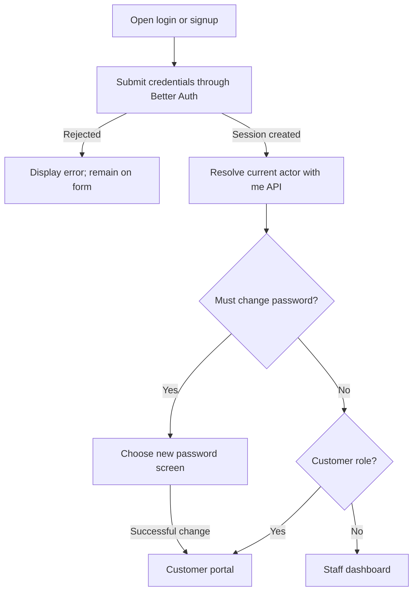
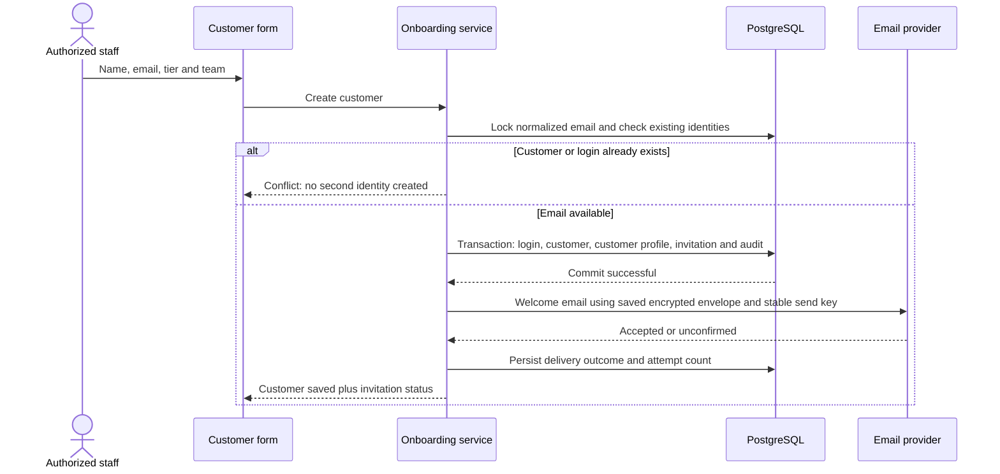
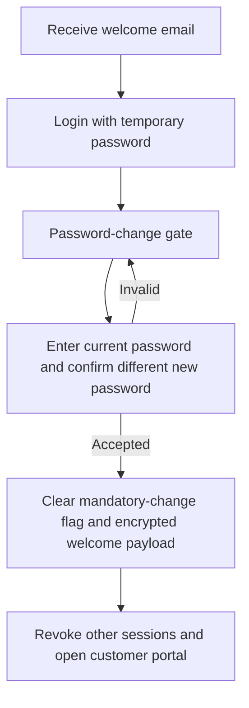
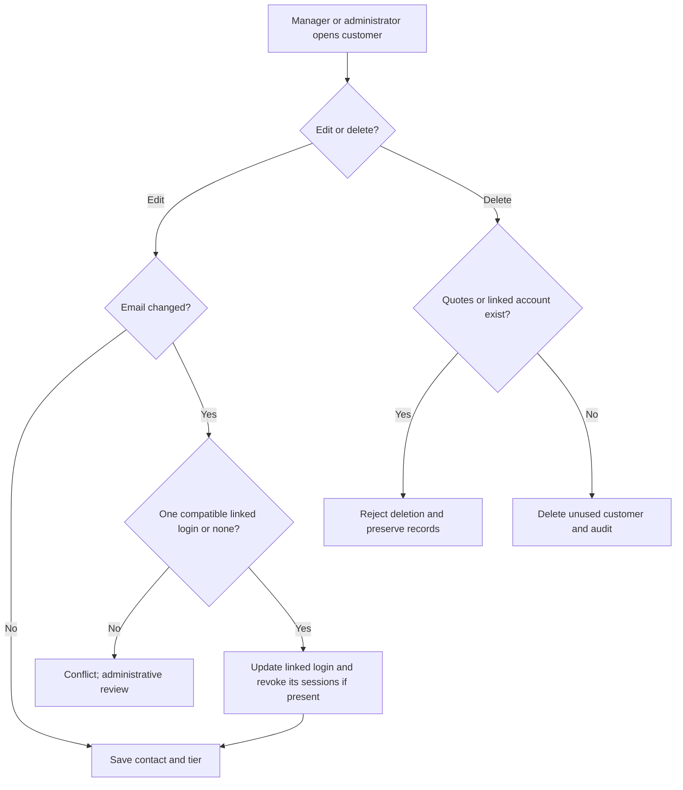
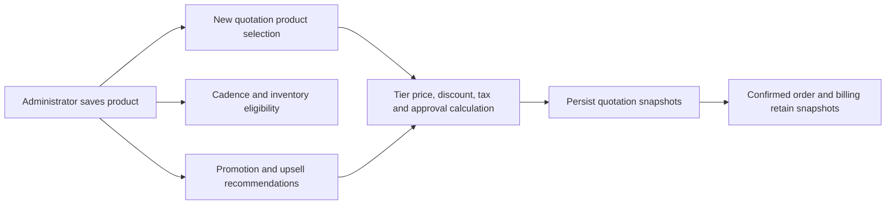
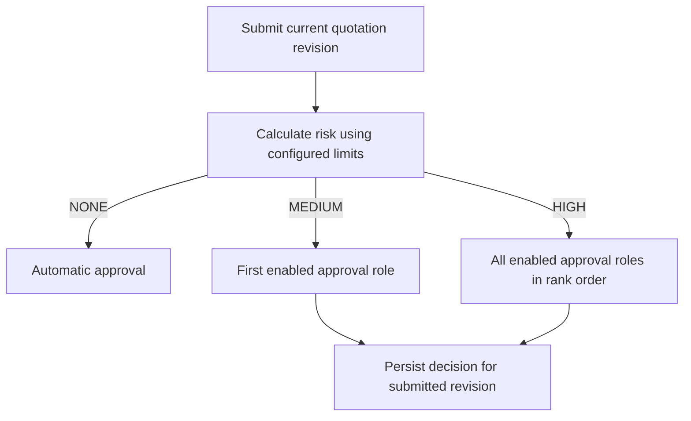

# Identity, customer onboarding, and administration

This guide explains the implemented account, customer, catalog, and policy flows. Examples
use fictional people and INR amounts. The [permission matrix](../../src/lib/domain/permissions.ts)
is the shared source for navigation and API roles; being an administrator does not grant
every business mutation. Finance owns billing operations and operations owns fulfillment.

## Sign up, sign in, session, and sign out

`/signup` accepts name, email, and password. `/login` accepts email and password. Forms use
POST and the submit button waits for client hydration. Password inputs require 8–128
characters. Authentication uses Better Auth credentials with PostgreSQL storage, not social
login. Public signup creates a login; a user without an assigned profile is treated as a
sales representative by the current actor resolver. Public signup is not the customer
onboarding workflow and does not allow the registrant to select manager/admin authority.

The server checks session cookies and resolves the persisted profile. An unauthenticated
protected API returns 401; disallowed roles return 403. Authenticated mutation requests
must carry an allowed Origin. The configured canonical origin and its same-scheme,
same-port `localhost`/`127.0.0.1` alias are accepted for local development; cookies remain
host-scoped, so signing in on one hostname does not sign in on the other.

Sign-in uses a full navigation to discard the previous account's client data. Staff **Sign
out** calls Better Auth and navigates to login only after success. Portal sign-out also
revokes its quote-scoped portal cookie. No account-recovery UI or configured reset-email
delivery is implemented here; a password-reset hook in authentication code does not by
itself create an operational recovery workflow. Email-verification delivery is likewise
not established by the login/signup screen.

Sources: [authentication form](../../src/features/identity/auth-form.tsx),
[auth configuration](../../src/lib/auth/create-auth.ts), [actor access](../../src/server/access.ts),
[workspace shell](../../src/features/shell/workspace-shell.tsx), and
[portal shell](../../src/features/portal/portal-shell.tsx).

## Create a customer and portal login

Representatives, managers, and administrators can open Customers. Only managers and administrators
can add a customer; representatives can view and search the directory and select customers in quotes.
The Add customer button is hidden for representatives, and `POST /api/v1/customers` returns 403
for their sessions without creating records or sending an invitation.
Enter the customer's name, email, tier (Bronze/Silver/Gold), and optional team. The server
normalizes email to lowercase and trims contact details. The new HTTP creation flow
creates both a customer and a linked customer-role credential account, rather than just
an address-book entry.

Example: a manager adds “Example Labs”, `contact@example.test`, Gold tier, West
team. The customer account is linked only to Example Labs. A generated temporary password
is included in the welcome email alongside the login URL. The normal customer-creation
response exposes delivery status, not the password. Better Auth stores the credential
hash; the separate welcome-email envelope is encrypted for bounded retry delivery.

The account/customer/profile/invitation intent are created together in one transaction.
Duplicate email or database conflicts roll back that creation, so an existing login is not
silently converted into a customer account. The provider call happens after commit: a
provider failure means “login saved; welcome email needs attention,” not “customer creation
rolled back.” The creating staff user's session is not replaced by the new customer's
session because provisioning disables auto sign-in.

## Welcome-email status and retry

Use a verified-domain `EMAIL_FROM` before onboarding real customers. Resend's test sender cannot
deliver to arbitrary customer addresses. Provider rejection now shows safe configuration guidance
without echoing private provider details. New sender configuration affects new invitations; an
existing retry preserves its original sender and exact message. See the
[onboarding operational limits](../architecture/customer-onboarding.md) before retrying a saved
test-sender invitation. There is no implemented sender-replacement/account-recovery screen.

The customer dialog displays **Welcome email accepted by provider** when status is SENT.
PENDING or FAILED shows that the saved account needs attention, with **Retry welcome email**.
Status retrieval and retry are restricted to the creating representative or authorized
manager/admin; a different representative cannot resend another representative's invitation.

| State or condition | User-visible behavior |
| --- | --- |
| Account created and provider accepts send | SENT; retain provider acceptance identity. |
| Missing provider configuration, rejection, or uncertain response | FAILED; saved customer/login remain; show recoverable delivery message. |
| Retry within 23 hours | Reuse the saved envelope and provider idempotency key. |
| Already SENT | Return existing status without sending another welcome message. |
| More than 23 hours since intent creation | Reject retry; administrator intervention is required. No implemented recovery screen is implied. |
| Password already changed | Original encrypted temporary-password payload is cleared; it cannot be resent. |
| Customer email differs from invitation recipient | Reject original invitation retry; do not send old credentials to a changed address. |

The 23-hour limit applies to retrying the original invitation, not a claim that the password
itself expires after 23 hours. Provider acceptance is not proof of inbox delivery, opening,
or spam-folder placement. Live inbox delivery has not been verified by this documentation
work. There is no automatic background invitation retry worker in this flow.

Sources: [onboarding service](../../src/features/catalog/customer-onboarding.ts),
[invitation status UI](../../src/features/catalog/customer-invitation-status.tsx), and
[catalog routes](../../src/features/catalog/routes.ts).

## First customer login and required password change

The customer signs in with the emailed temporary password and lands on `/change-password`.
They enter the temporary password, a different new password, and its confirmation. A mismatch
or reuse of the temporary password is rejected. Successful change requests revocation of
other sessions, clears `mustChangePassword`, removes the encrypted invitation payload, and
opens `/portal`. Protected credential-based customer access is blocked before this step;
the `/me` identity lookup remains available so login can route correctly.

[Change-password form](../../src/features/identity/change-password-form.tsx) and
[auth hooks](../../src/lib/auth/create-auth.ts) implement this flow. The temporary password
must never be pasted into logs, screenshots, documentation, or issue comments.

## Credential portal versus quotation-link access

A customer credential session sees eligible quotations for its linked customer. An emailed
quotation link is a separate, limited access mechanism: its single-use token is exchanged
for an eight-hour HttpOnly portal cookie scoped to one quotation. Expired, revoked, or
already-redeemed links cannot be redeemed again. That link path is independent of credential
onboarding; it should not be described as a general customer-account login or as passing
the password-change flow.

A quote-scoped cookie cannot open a different quote, even for the same customer. Credential
access requires customer role and the matching customer relationship. Draft, returned, and
rejected quotes are excluded from public detail. Public quote serialization omits internal
cost fields and internal notes. Portal sign-out revokes its scoped access and clears the
cookie, then signs out any credential session. For negotiation and confirmation details,
follow the quotation-flow guide in this directory.

Sources: [portal identity and serialization](../../src/features/quotes/portal-access.ts) and
[portal routes](../../src/features/quotes/portal-routes.ts).

## Edit and delete customers

In Customers, managers and administrators select **Edit customer** on an existing row.
The dialog footer includes **Delete customer**, followed by a separate confirmation dialog.
Cancel preserves the customer; a blocked deletion explains the linked-record restriction without
closing the editor. The Add customer dialog has no delete action, and representatives do not
receive customer edit/delete controls.

Manager/admin roles create, edit and delete customers. Representatives have read-only directory access. A manager can
change name, contact email, tier, and team. Tier changes affect new quote pricing and policy
evaluation; already-stored quote snapshots are not silently rewritten by editing a contact.

For an email change with exactly one linked customer login, the transaction updates the
login email, marks it unverified, and revokes that user's sessions. The customer must sign
in using the updated email. More than one linked login, or a non-customer linked profile,
blocks the automatic change. A conflicting login email rejects and rolls back the change.
Updating the email does not send a fresh welcome invitation or implement account recovery;
the original invitation recipient is not rewritten.

Example: changing a Gold customer to Silver changes the default tier for future quoting.
Deleting a customer with an existing quote is rejected. Newly onboarded customers already
have a linked portal account, so this delete action cannot remove them; deletion is for
unused unlinked records. No cascade erases their order/payment history.

Sources: [customer lifecycle](../../src/features/catalog/customer-lifecycle.ts),
[customer save service](../../src/features/catalog/service.ts), and
[delete dialog](../../src/features/shell/customer-delete.tsx).

## Administrator product catalog

The administrator opens Product catalog, searches or filters products, then creates a product
or opens a row to edit. Product configuration contains name, category, unit, variant label,
description, INR unit price/cost, tax percentage, cadence, inventory tracking, active flag,
promotion, and upsell products. A variant is a catalog-record label, not a generated
matrix of sizes/colors with separate hidden pricing rules.

| Configuration | Effect and example |
| --- | --- |
| Category | Hardware, Services, or Subscription. Hardware is eligible for tier price factors. |
| Price / cost | Integer paise persisted; ₹1,250 becomes 125,000 paise. API supports 0–10,000,000 paise per configured price/cost. |
| Tax and promotion | Basis points internally; 18% tax is 1,800 bps and 5% promotion is 500 bps. |
| Cadence | One-time, monthly, quarterly, or yearly: 0, 1, 3, or 12 months. Recurring products cannot track stock. |
| Active | Controls availability for new selection. Existing saved commercial history is retained. |
| Promoted | Newly added quote lines use the configured promotion as their initial line discount. The discount remains subject to quote validation and approvals. |
| Upsell products | Up to five other catalog product IDs can be recommended with this item. A laptop may suggest a care plan; selecting a recommendation adds an actual quote line. |

Upsell products influence recommendations; they do not automatically add products without the
user's selection. Confirmed upsell reporting checks that an upsell line is supported by a configured
source product present in the quote. Product saves are validated and audited. Deactivate through
the Active flag; no product-delete endpoint is provided in this catalog route set.

Sources: [catalog editor](../../src/features/shell/catalog-editor.tsx),
[catalog schema](../../src/features/catalog/model.ts),
[product save service](../../src/features/catalog/service.ts), and
[quotation pricing](../../src/features/quotes/rules.ts).

## Business policy settings and configurable approvals

Manager/admin roles open Settings and save a policy card. Percentages are expressed as basis
points: 100 = 1%. Allowed policy groups are discounts, pricelists, health, and
approvalChain. Unsupported names/keys and out-of-range values are rejected and successful
changes are audited. New submissions use policy values; do not describe an old approval as
automatically granted for later edited terms.

Inventory and warehouse setup are available through the dedicated **Inventory** navigation item
at `/inventory`. Settings contains business policies only; it does not embed the inventory screen.

| Policy | Meaning |
| --- | --- |
| Pricelists | Hardware tier factors. At 9,000 bps a ₹10,000 catalog price becomes ₹9,000 for that tier before discounts/tax. Services/subscriptions do not use this hardware factor. |
| Discounts | Tier and category ceilings, plus HIGH-risk line/total exceedance thresholds. The tighter tier/category ceiling applies. |
| Health | Stale/approval/overdue days and historical discount-anomaly settings; these are attention rules, not approval authority. |
| Approval chain | Positive unique ranks determine enabled manager/finance order; 0 disables a role. At least one role remains enabled. |

For default tier factors, Bronze pays 100%, Silver 95%, and Gold 90% of Hardware list price.
These are configurable values, not a subscription entitlement. A Gold hardware line with
a 10% line discount and 5% order discount receives a combined 14.5% discount against its
tier-adjusted price, because the discounts multiply rather than add.

Example: manager rank 1 and finance rank 2 requires manager then finance for HIGH risk.
Finance rank 1 and manager rank 2 reverses that order. Disabling finance with rank 0 leaves
manager as the enabled chain. Configuration is not hard-coded to a fixed two-step order.
The approval service retains workflow/actor checks in addition to the role-based access gate.
Settings does not provide a generic account-role-management screen.

Sources: [settings UI](../../src/features/shell/settings.tsx),
[settings validation](../../src/features/catalog/service.ts),
[approval chain](../../src/features/quotes/approval-policy.ts), and
[quote workflow service](../../src/features/quotes/service.ts).

## Navigation and verification

The sidebar groups Overview/Quotations/Customers/Approvals, operational screens, and
management screens. Each item uses the shared permission matrix; route layouts and APIs
also enforce their own access. Customers use the separate portal shell. A missing navigation
item does not replace server authorization, and an accessible dashboard does not grant all
actions displayed to another role. See [workspace navigation](../../src/features/shell/workspace-shell.tsx).

Existing executable coverage includes [customer lifecycle integration](../../test/integration/customer-lifecycle.regression.test.ts),
[onboarding integration](../../test/integration/customer-onboarding.regression.test.ts),
[onboarding browser journeys](../../playwright/e2e/customer-onboarding.spec.ts),
[customer browser flows](../../playwright/e2e/customers.spec.ts),
[catalog browser CRUD](../../playwright/e2e/catalog.spec.ts),
[role browser checks](../../playwright/e2e/role-access.spec.ts),
[origin integration](../../test/integration/auth-origins.regression.test.ts), and
[approval workflow integration](../../test/integration/approval-workflow.regression.test.ts).
These are coverage references, not claims that this documentation agent executed them or
that an actual inbox received an email. The implementation handoff records final run results.

A reviewer can create a new customer as a manager or admin, inspect the saved invitation status, sign in
with controlled test credentials, complete the required change, and verify customer-only
portal access. Retry a failed invitation using a controlled provider fixture; verify existing
identity conflict and linked-account deletion rejection. As admin, add a ₹1,250 product,
edit its variant/promotion/pairings, and quote it as a rep. As manager, change an approval
rank configuration and submit a fresh risk-bearing quote to observe the configured route.
Real email delivery and recovery after an expired retry window require separate operational
verification and, for recovery, an additional implemented workflow.
