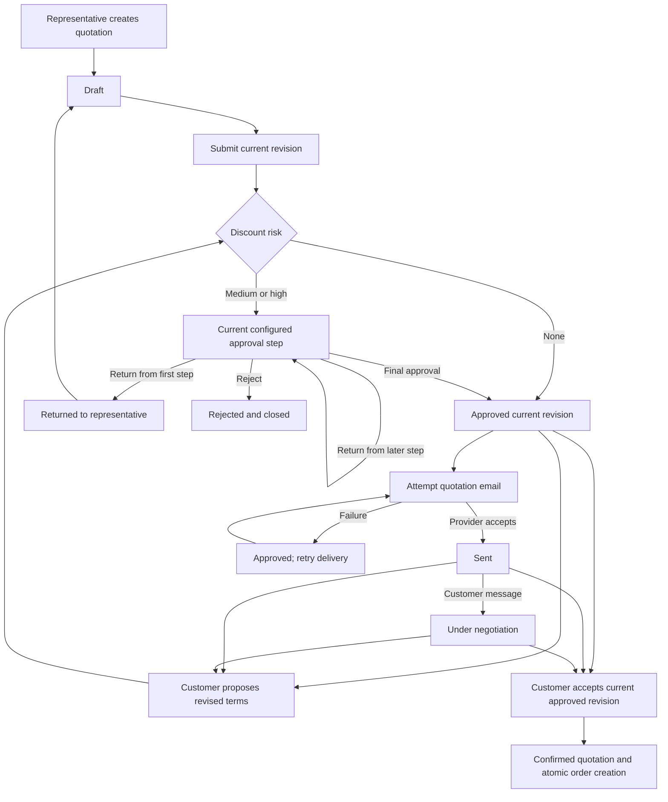
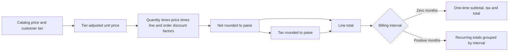
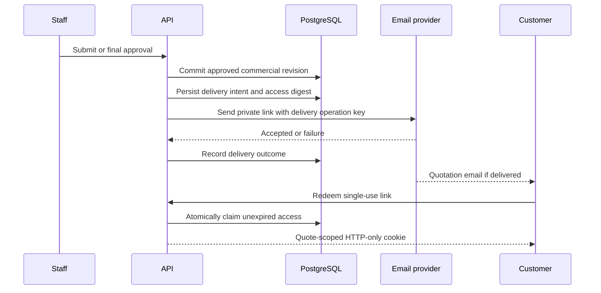
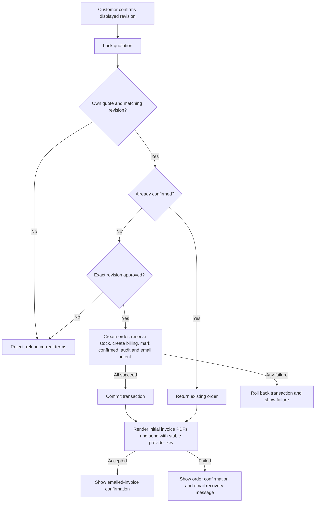

# Quotations, approvals, and customer negotiation

This guide describes the implemented workflow, including its current limits. Money examples use
INR; stored legacy `*Cents` fields represent paise. There is no foreign-exchange conversion. See
[currency policy](../architecture/currency.md). Settings can override the default pricing and
approval examples below.

## Who does what

| Actor | Quotation actions | Boundary |
| --- | --- | --- |
| Sales representative | Create, edit, submit, copy closed quotes, send approved terms | Own quotations only; cannot approve or accept for a customer |
| Sales manager | Read quotations, decide their assigned approval step, send approved terms | Cannot edit quotation commercial terms |
| Finance | Read quotations, decide their assigned approval step, send approved terms | Cannot skip the current approval step |
| Operations | Read quotations | Fulfillment work follows the confirmed order |
| Admin | Read quotations | No quotation creation, approval, sending, or customer acceptance |
| Customer | View permitted portal quotations, message, counter, accept | Own customer account or the single quotation granted by an access link |

These permissions are enforced by the API, not merely navigation. Representative ownership is
checked again inside the transaction. Customer credentials cannot use the staff workspace; staff
credentials cannot use the customer portal. Source: [permissions](../../src/lib/domain/permissions.ts),
[quote routes](../../src/features/quotes/routes.ts), and
[portal access](../../src/features/quotes/portal-access.ts).

## Complete commercial lifecycle

The diagram's email step runs automatically after representative submission or final staff approval.
A within-policy customer counter is approved directly by the counter endpoint; that endpoint does
not itself send an email. Every counter creates a new revision. A discussion message does not change
commercial terms or invalidate approval.

## Create, edit, save, and duplicate

1. The representative chooses **Create quotation** from the dashboard or quotation list and reaches
   the new quotation form. Select a customer by name/tier and optionally a promised delivery date.
   The date must be today or later; the picker blocks earlier dates and the server independently
   rejects a past or invalid calendar date.
2. Select an active product and add it. Set quantity and line discount; add or remove other lines.
   Products provide price, cost, tax, variant, category, and billing interval. The server obtains
   these values from the catalog rather than accepting a client-calculated total.
3. Optionally add an order discount and internal justification. The preview recalculates price,
   tax, margin, and approval risk. Internal notes and costs are excluded from the customer's quote.
4. **Save draft** persists without submission. **Save and submit** first saves, then calls submission
   using the returned revision. Successful saving opens that quotation's detail page.
5. Editing any nonterminal quotation creates another draft revision and clears prior approval.
   Submit it again before the customer can accept. Confirmed/rejected quotations cannot be edited;
   **Copy to new draft** creates a separate quotation, repriced against the current catalog/tier.

The selected customer's tier affects pricing and limits immediately. Promotions initialize the
line discount when a product is added; they do not bypass approval rules. Changing a customer
reprices the form for that customer's tier. Each line has a unique identity, including repeated
products.

Validation covers 1–100 lines, unique line IDs, integer quantities 1–10,000, and discounts 0–100%.
Tax and monetary inputs must be nonnegative safe integers. Supported one-time and recurring totals
are individually capped at 2,000,000,000 paise (₹2,00,00,000); the absolute one-time margin has the
same cap. Invalid values disable saving and show an explanation. Server validation remains decisive.

Saving and submitting are separate requests: if submission fails after saving, the draft can
already exist. Reload the quotation list before repeating a new-quotation operation; new quote
creation has no client idempotency key. Existing saves reject stale revisions with HTTP 409 rather
than overwriting another change. Source: [editor](../../src/features/quotes/quote-editor.tsx),
[detail](../../src/features/quotes/quote-detail.tsx), [service](../../src/features/quotes/service.ts).

## Pricing, customer tiers, tax, and recurrence

| Default tier | Hardware price factor | Customer discount ceiling |
| --- | --- | --- |
| Bronze | 100% of catalog price | 5% |
| Silver | 95% of catalog price | 10% |
| Gold | 90% of catalog price | 15% |

Tier price factors apply to Hardware only. Services and Subscriptions retain their catalog price.
These factors are separate from discounts: Gold hardware already receives the tier price before
the explicitly entered discounts. The line ceiling is the lower of customer and category limits.
Default category ceilings are Hardware 15%, Services 10%, Subscription 15%.

For example, Gold hardware with catalog price ₹10,000 gets a ₹9,000 tier price. With quantity 2,
10% line discount and 5% order discount, net is ₹15,390. At 18% tax, tax is ₹2,770.20 and total is
₹18,160.20. The effective discount against the tier-adjusted price is 14.5%, not 15%:
`1 − (1 − 0.10) × (1 − 0.05)`. It is within the default 15% Gold/Hardware ceiling.

Net and then tax round independently to paise using integer arithmetic. Discounts apply before tax.
One-time margin is net revenue less catalog cost multiplied by quantity; tax is not profit.

**Why can one-time total be ₹0?** A subscription-only quotation has no one-time lines. For a
₹1,000 monthly plan with 18% tax and no discount, one-time total is ₹0 and recurring monthly total
is ₹1,180. Add a ₹2,000 one-time setup service at 18% tax and the one-time total becomes ₹2,360;
the monthly total remains ₹1,180. Monthly and yearly charges must not be read as the same cadence.

The quotation editor shows a separate breakdown for each billing interval: tier-adjusted value
before discounts, combined line/order discount savings, subtotal after discounts, tax, total and
margin before tax. Products with the same interval are summed together. Subscription-only quotes
show “No one-time charges” instead of a prominent zero total. For example, a ₹400 annual plan with
2% line discount and 2% order discount (no tax) shows ₹15.84 savings and ₹384.16 annual total.
Changing quantity, discounts or customer recalculates this preview; removing a line updates its
group. Invalid input hides unavailable totals and approval claims until corrected; it does not
replace them with zero. This is a billing-period estimate, not an invoice or an amount due today:
subscription start dates and proration are applied during billing.

Sources: [editor summary](../../src/features/quotes/quote-summary.tsx),
[summary regression tests](../../test/unit/quote-summary.regression.test.tsx),
[browser totals test](../../playwright/e2e/quotation-totals.spec.ts).

The combined `recurringCents` field sums recurring line totals without normalizing their periods;
the portal instead groups visible totals by interval. It is not monthly recurring revenue.
Source: [pricing rules](../../src/features/quotes/rules.ts),
[portal presentation](../../src/features/portal/portal-detail.tsx).

## Recommendations and add-ons

Catalog editors can configure up to five **Upsell products** for each catalog item. The database
enforces that limit, and the API rejects duplicate, missing, or self-referencing product IDs. The
catalog relationship is directional: configuring a care plan for a laptop does not configure the
laptop for the care plan.

**Upsell recommendations** replaces customer purchase history and global best sellers. It is driven
only by products already on the quotation: inactive or already-selected products are excluded. With
one selected product, its configured upsells are shown. With multiple selected products, the panel
takes one candidate from each selected product before taking a second from any source. Every pass is
ordered by current estimated sale value, then margin, promotion discount, and product ID; this keeps
the maximum five recommendations commercially prioritized while dividing them across the selected
products. Fewer eligible relationships produce fewer than five results.

The current customer tier, promotion, and order discount determine the displayed estimated price and
margin. Adding an item records it as an upsell; saving the quotation independently verifies that an
already-selected product configured that relationship. For example, selecting a laptop and a dock
can interleave the laptop's care plan and mouse with the dock's monitoring add-on. A selected,
inactive, or duplicate candidate is never shown.

Sources: [catalog relationship editor](../../src/features/shell/catalog-editor.tsx),
[recommendation allocator](../../src/features/quotes/upsell-recommendations.ts),
[recommendation UI](../../src/features/quotes/purchase-recommendations.tsx), and
[quotation pricing and provenance](../../src/features/quotes/rules.ts).

## Approval decisions and board movements

Risk uses the amount by which each effective discount exceeds its ceiling. Identical commercial
lines are normalized for this calculation so splitting the same quantity does not change routing.
No excess means `NONE`. Default `HIGH` boundaries are any line at least 5 percentage points over,
or the sum of normalized excesses at least 8 points. Other excesses are `MEDIUM`.

Examples with default settings: Bronze Hardware at 5% is automatic; at 6% it is medium; at 10%
it is high. Gold Services still has a 10% ceiling because Services is more restrictive than Gold.
These are percentage-point thresholds, not rupee thresholds.

The default chain is Sales Manager then Finance. Medium uses the first configured step; high uses
the full configured chain. Configuration can reorder or narrow the chain. Only the role currently
recorded on the quotation may act. Each approval, return, or rejection requires a reason. Approval
at the last step marks that revision approved; intermediate approval leaves it pending. Returning
from Finance in the default high-risk chain returns it to the manager; returning from the first
step sends it back to the representative. Reject closes it.

The board is another view of these APIs, not a free status editor:

| Board column | Underlying statuses | Permitted outgoing action |
| --- | --- | --- |
| Draft | DRAFT, RETURNED | Representative submits |
| In approval | PENDING_APPROVAL | Current approver approves, returns, or rejects |
| Approved | APPROVED | Authorized sender sends quotation |
| Negotiation | SENT, UNDER_NEGOTIATION | Customer works in the portal |
| Confirmed | CONFIRMED | None; order already exists |
| Rejected | REJECTED | None; representative can copy to a new draft |

A submitted within-policy card may land directly in Negotiation after automatic email acceptance;
an intermediate approval remains In approval even if the user targeted Approved. Server state is
authoritative. Stale approval returns 409; reload before deciding again. The approval chain is read
from current settings during decisions, so it is not an immutable per-quote workflow snapshot.
Source: [approval policy](../../src/features/quotes/approval-policy.ts),
[board transition rules](../../src/features/quotes/board-transitions.ts).

## Delivery and customer access

Approved submission/final approval attempts email automatically. Delivery intent persists before
the provider call. A provider failure records a failed attempt and keeps the commercial approval;
staff can retry sending. A stable delivery operation key is reused for retries, and a late failed
attempt cannot downgrade a delivery already accepted by the provider. `SENT` means provider
acceptance, not proof that the customer received or read the email.

An access link lasts 24 hours and can be redeemed once. Redemption atomically exchanges it for an
HTTP-only eight-hour portal session scoped to one quote. Credential customer sessions see eligible
quotes for their linked customer account. Draft, Returned, and Rejected are not accessible in the
portal. Logout revokes the link session. The send API can renew access after its one-minute cooldown,
revoking previous quote access; this API ability is not a promise of a separate renewal button.

Source: [email delivery](../../src/features/quotes/email.ts),
[redemption and public projection](../../src/features/quotes/portal-access.ts).

## Conversation, counteroffers, and acceptance

The customer can send a whole-quotation or line-specific message of up to 2,000 characters. Blank
messages and unknown lines are rejected. A message changes Sent to Under negotiation but preserves
the approved revision, so acceptance remains available. Messages may still be added after
confirmation; commercial countering and acceptance controls are then closed.

Current conversation is **not complete real-time two-way chat**: the portal polls every 15 seconds
and refreshes after its own mutations. Staff detail displays received messages but has no reply
composer or explicit periodic message refresh. There is no quotation chat WebSocket/SSE path.
The portal returns the oldest 200 messages, while staff detail returns the newest 100; neither
thread currently exposes pagination. A message retry after an ambiguous network failure can insert
a duplicate because posting messages has no idempotency key.

To negotiate, the customer changes line discounts and optionally a delivery date, then selects
**Request changes**. Quantities, products, and order-level discount are not editable in that form.
The server recalculates current policy, saves a revision/risk snapshot, and routes it to automatic
approval or the configured approver. While pending, acceptance is unavailable. A date-only counter
also creates a revision, but risk is still discount-based; it does not independently require a
delivery-capacity review. Requested delivery dates must be today or later, whether submitted from
the browser or directly to the portal API. The UI's general “sent for review” notice does not imply
manual review when risk is NONE.

Example: Bronze hardware countered from 5% to 10% discount is high risk with default settings.
Manager and Finance approve sequentially before the customer can accept that new revision.
Attempting acceptance with the previous revision returns 409.

The customer quotation table shows each product's quantity, unit price, line discount percentage,
combined line/order discount savings, subtotal after discounts, tax and total including tax.
The page and confirmation dialog reuse the same public price breakdown: before-discount amounts,
savings, subtotal, tax and total are summed from saved lines separately for one-time, monthly,
annual and other billing periods. No catalog repricing or internal margin/cost data is used.
For example, an annual ₹400 plan with 2% line and 2% order discounts shows ₹15.84 saved and
₹384.16 net/total with zero tax. Fully discounted subscriptions remain visible with a zero total;
subscription-only quotes state that there are no one-time charges. Negotiation refreshes the saved
revision and its displayed amounts before confirmation. Subscription billing-period totals are not
amounts due immediately; first-invoice proration depends on the billing start date.
See [portal breakdown](../../src/features/portal/portal-quote-totals.tsx),
[snapshot tests](../../test/unit/portal-totals.regression.test.tsx), and
[confirmation browser test](../../playwright/e2e/portal-totals.spec.ts).

**Confirm order** opens a confirmation dialog showing the current revision and separate one-time
and recurring charges. Customer confirmation locks the quote, verifies that exact revision is
approved, creates the order, reserves stock, creates billing, marks the quote Confirmed, and writes
an audit event plus a durable invoice-email intent in one database transaction. Failure rolls the
transaction back. After commit, the portal renders the confirmed order's initial invoice PDFs with
the same renderer as **Download PDF** and sends them to the customer email captured at confirmation.
Mixed one-time/recurring orders send one email with each initial invoice attached; later renewals,
adjustments, and credits are not added to that confirmation email. A repeated valid confirmation
returns the existing order (and idempotently heals any missing invoice/subscription identities) and
reuses the same delivery identity, preventing duplicate orders or accepted provider mail.

After confirmation, staff see the new work **newest-first**:

| Quote lines | Invoice | Subscription | Fulfillment / shipment |
| --- | --- | --- | --- |
| One-time only | One `ONE_TIME` invoice | None | Order appears; stockable lines allocate; service-only may be `FULFILLED` with no warehouse rows |
| Recurring only | One `RECURRING` invoice per recurring line | One subscription per recurring line | Order still appears in the fulfillment queue |
| Hybrid | Separate one-time and recurring invoices | Subscriptions for recurring lines only | Same order drives shipment for stockable demand |

All payments settle on invoices only. Fulfillment may still require stock/backorder handling;
confirmation is not proof of shipment, payment, or inbox delivery.

Source: [portal routes](../../src/features/quotes/portal-routes.ts),
[conversation UI](../../src/features/portal/portal-conversation.tsx),
[counter UI](../../src/features/portal/portal-counter.tsx),
[transactional service](../../src/features/quotes/service.ts), and
[invoice email delivery](../../src/features/billing/invoice-email.ts).

## Evidence and verification boundaries

These are existing executable specifications, not a claim that a test run occurred while writing
this document. Consult the implementation handoff/CI for the commands and results actually run.
Provider-boundary tests do not prove live inbox delivery; a customer message browser test does not
prove staff replies or real-time synchronization.

| Flow | Evidence |
| --- | --- |
| Full builder → upsell → sequential approvals → customer counter → order | [Quotation browser journey](../../playwright/e2e/quotation-journey.spec.ts) |
| Customer sign-in, message, counter, confirmation dialog | [Portal browser journey](../../playwright/e2e/portal.spec.ts) |
| Customer switch and purchase suggestions | [Recommendations browser tests](../../playwright/e2e/quote-recommendations.spec.ts), [integration](../../test/integration/quote-recommendations.regression.test.ts) |
| Quantity, discount limits, rounding, tier prices, risk thresholds | [Pricing regression](../../test/unit/quote-rules.regression.test.ts), [numeric input browser tests](../../playwright/e2e/number-input.spec.ts) |
| Board allowed actions and persisted decisions | [Board unit tests](../../test/unit/quote-board-transitions.regression.test.ts), [integration](../../test/integration/quote-board.regression.test.ts) |
| Finance return and configurable approval ordering | [Approval integration](../../test/integration/approval-workflow.regression.test.ts) |
| Quote-scoped access, private-field exclusion, concurrent token redemption, duplicate confirmation | [Portal integration](../../test/integration/portal.regression.test.ts) |
| Confirm creates invoice / subscription / fulfillment ordering and queues invoice email | [Confirm billing integration](../../test/integration/confirm-billing.regression.test.ts) |
| Failed delivery retry, renewal, late retry races | [Email integration](../../test/integration/email.regression.test.ts) |
| INR formatting and document output | [Money regression](../../test/unit/money.regression.test.ts), [billing documents](../../test/unit/billing-documents.test.ts) |
